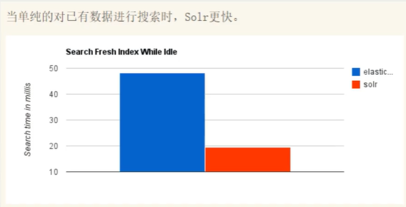
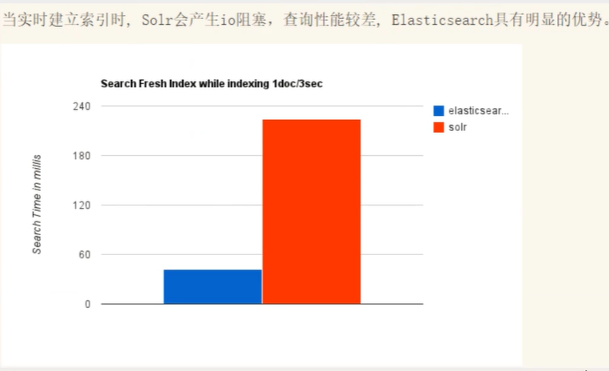
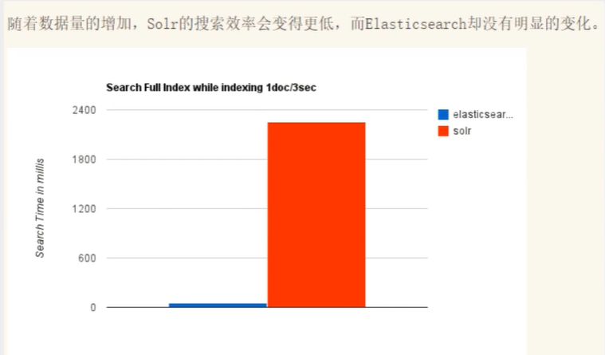
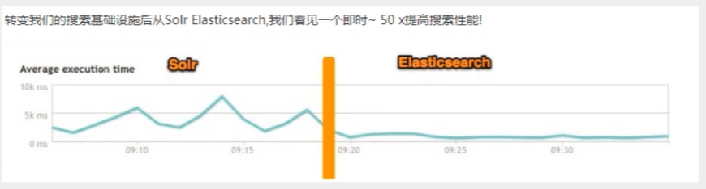
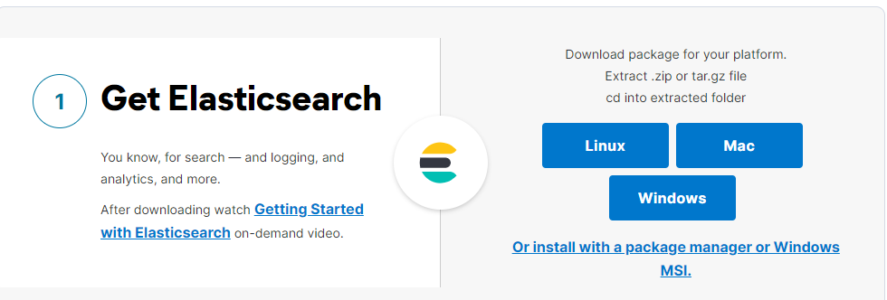
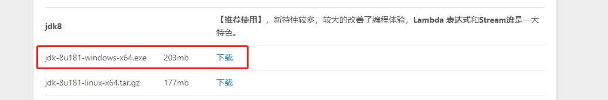
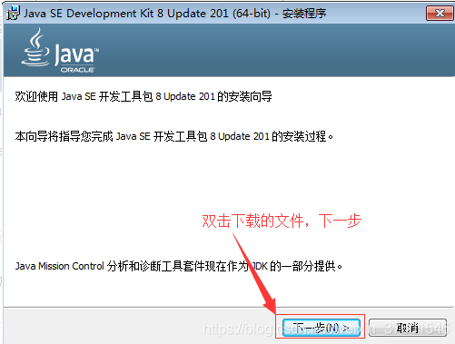
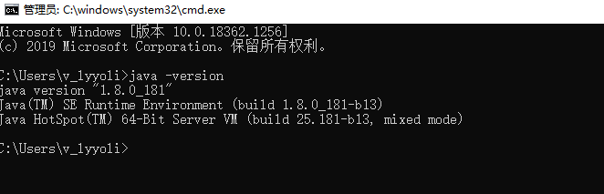
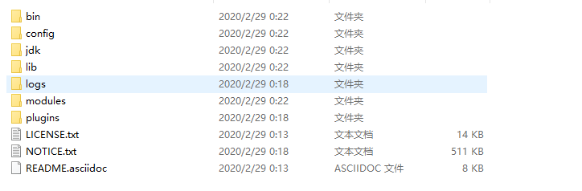
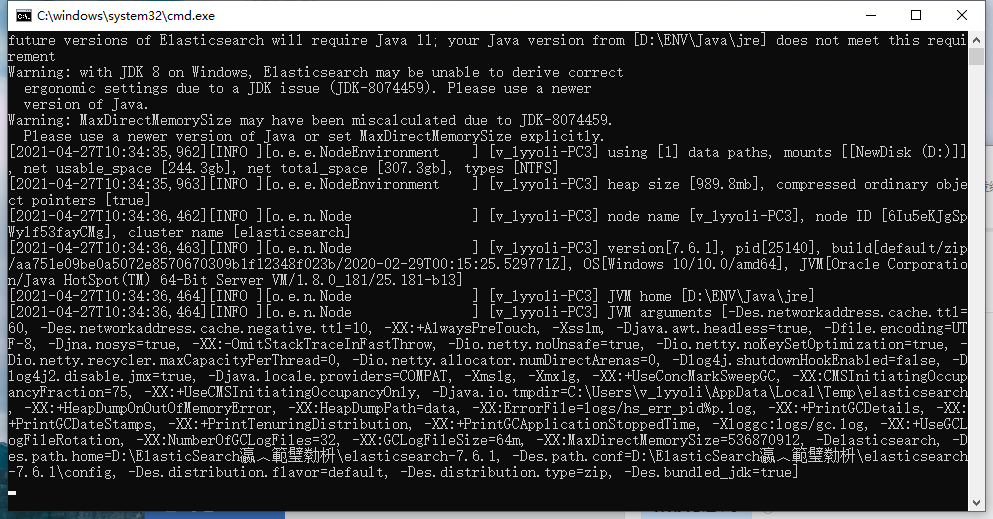

# ElasticSearch（初级）

版本：ElasticSearch7.6.1

官网：[Download Elasticsearch Free | Get Started Now | Elastic | Elastic](https://www.elastic.co/cn/downloads/elasticsearch)

6.X和7.X的区别十分大，6.X的API（原生API、RestFul高级）

分布式的全文检索功能

> 我们要讲解什么？

SQL：like%狂神说%,如果是大数据，就十分慢，索引

ElasticSearch：搜索（百度、github、淘宝电商）

聊一个人

货比三家

安装

生态圈

分词器ik

RestFul操作 ES

CRUD

# 聊聊Doug Cutting

为什么要了解这个人：大数据  hadoop

> 故事内容来自公众号：鲜枣课堂

1998年9月4日，Google公司在美国硅谷成立。正如大家所知，它是一家做==搜索==引擎起家的公司。


无独有偶，一位名叫**Doug Cutting**的美国工程师，也迷上了搜索引擎。他做了一个用于文本搜索的函数库（姑且理解为软件的功能组件），命名为**Lucene**。


Lucene是用JAVA写成的，目标是为各种中小型应用软件加入==全文检索==功能。因为好用而且==开源==（代码公开），非常受程序员们的欢迎。

早期的时候，这个项目被发布在Doug Cutting的个人网站和SourceForge（一个开源软件网站）。后来，2001年底，Lucene成为**Apache软件基金会**jakarta项目的一个子项目。


2004年，Doug Cutting再接再励，在Lucene的基础上，和Apache开源伙伴Mike Cafarella合作，开发了一款可以代替当时的主流搜索的开源搜索引擎，命名为**Nutch**。


Nutch是一个建立在Lucene核心之上的网页搜索应用程序，可以下载下来直接使用。它在Lucene的基础上加了网络爬虫和一些网页相关的功能，目的就是从一个简单的站内检索推广到全球网络的搜索上，就像Google一样。

Nutch在业界的影响力比Lucene更大。

大批网站采用了Nutch平台，大大降低了技术门槛，使低成本的普通计算机取代高价的Web服务器成为可能。甚至有一段时间，在硅谷有了一股用Nutch低成本创业的潮流。（大数据！）

随着时间的推移，无论是Google还是Nutch，都面临搜索对象“体积”不断增大的问题。

尤其是Google，作为互联网搜索引擎，需要存储大量的网页，并不断优化自己的搜索算法，提升搜索效率。


Google搜索栏

在这个过程中，Google确实找到了不少好办法，==并且无私地分享了出来==。开源

大数据就两个问题：存储+计算

2003年，Google发表了一篇技术学术论文，公开介绍了自己的谷歌文件系统**GFS（Google File System）**。这是Google公司为了==存储海量搜索数据==而设计的专用文件系统。

第二年，也就是2004年，Doug Cutting基于Google的GFS论文，实现了**分布式文件存储系统**，并将它命名为**NDFS（Nutch Distributed File System）**。


还是2004年，Google又发表了一篇技术学术论文，介绍自己的**MapReduce编程模型**。这个编程模型，用于大规模数据集（大于1TB）的并行分析运算。

第二年（2005年），Doug Cutting又基于MapReduce，在Nutch搜索引擎实现了该功能。


2006年，当时依然很厉害的**Yahoo（雅虎）公司**，招安了Doug Cutting。


这里要补充说明一下雅虎招安Doug的背景：2004年之前，作为互联网开拓者的雅虎，是使用Google搜索引擎作为自家搜索服务的。在2004年开始，雅虎放弃了Google，开始自己研发搜索引擎。所以。。。

加盟Yahoo之后，Doug Cutting将NDFS和MapReduce进行了升级改造，并重新命名为**Hadoop**（NDFS也改名为HDFS，Hadoop Distributed File System）。

这个，就是后来大名鼎鼎的大数据框架系统——Hadoop的由来。而Doug Cutting，则被人们称为**Hadoop之父**。


Hadoop这个名字，实际上是Doug Cutting他儿子的黄色玩具大象的名字。所以，Hadoop的Logo，就是一只奔跑的黄色大象。


我们继续往下说。

还是2006年，Google又发论文了。

这次，它们介绍了自己的**BigTable**。这是一种分布式数据存储系统，一种用来处理海量数据的非关系型数据库。

Doug Cutting当然没有放过，在自己的hadoop系统里面，引入了BigTable，并命名为**HBase**。


好吧，反正就是紧跟Google时代步伐，你出什么，我学什么。

所以，Hadoop的核心部分，基本上都有Google的影子。


2008年1月，Hadoop成功上位，正式成为Apache基金会的顶级项目。

同年2月，Yahoo宣布建成了一个拥有1万个内核的Hadoop集群，并将自己的搜索引擎产品部署在上面。

7月，Hadoop打破世界纪录，成为最快排序1TB数据的系统，用时209秒。

此后，Hadoop便进入了高速发展期，直至现在。

> Lucene

Lucene是一套信息检索工具包！jar包，不包含搜索引擎系统

包含的：索引结构，读写索引的工具，排序，搜索规则功能，工具类

Lucene和ElasticSearch关系：

ElasticSearch是基于Lucene做了一些封装和增强（上手十分简单）

# ElasticSearch概述

Elaticsearch ,简称为es，es是一个开源的==高扩展==的==分布式全文检索引擎==，它可以近乎==实时的存储、检索数据==;本身扩展性很好，可以扩展到上百台服务器，处理PB级别（大数据时代）的数据。es也使用Java开发并使用Lucene作为其核心来实现所有索引和搜索的功能，但是它的目的是通过简单的==RESTful API==来隐藏Lucene的复杂性，从而让全文搜索变得简单。

据国际权威的数据库产品评测机构DB Engines的统计，在2016年1月，ElasticSearch已超过Solr等，==成为排名第一的搜索引擎类应用。==

> 历史

多年前，一个叫做Shay Banon的刚结婚不久的失业开发者，由于妻子要去伦敦学习厨师，他便跟着也去了。在他找工作的过程中，为了给妻子构建一个食谱的搜索引擎，他开始构建一个早期版本的Lucene。

直接基于Lucene工作会比较困难，所以Shay开始抽象Lucene代码以便]ava程序员可以在应用中添加搜索功能。他发布了他的第一个开源项目，叫做“Compass"。

后来Shay找到一份工作，这份工作处在高性能和内存数据网格的分布式环境中，因此高性能的、实时的、分布式的搜索引擎也是理所当然需要的。然后他决定重写Compass库使其成为一个独立的服务叫做Elasticsearch。

第一个公开版本出现在2010年2月，在那之后Elasticsearch已经成为Github上最受欢迎的项目之一，代码贡献者超过300人。一家主营Elasticsearch的公司就此成立，他们一边提供商业支持一边开发新功能，不过Elasticsearch将永远开源且对所有人可用。

Shay的妻子依旧等待着她的食谱搜索......

**谁在使用∶**

1、维基百科，类似百度百科，全文检索，高亮，搜索推荐/2（权重，百度）

2、The Guardian (国外新闻网站），类似搜狐新闻，用户行为日志(点击，浏览，收藏，评论)+社交网络数据（对某某新闻的相关看法），数据分析，给到每篇新闻文章的作者，让他知道他的文章的公众反馈（好，坏，热门，垃圾，鄙视，崇拜)

3、Stack Overflow(国外的程序异常讨论论坛)，IT问题，程序的报错，提交上去，有人会跟你讨论和回答，全文检索，搜索相关问题和答案，程序报错了，就会将报错信息粘贴到里面去，搜索有没有对应的答案

4、GitHub (开源代码管理)，搜索上千亿行代码

5、电商网站，检索商品

6、日志数据分析，logstash采集日志，ES进行复杂的数据分析，==ELK技术，elasticsearch+logstash+kibana==

7、商品价格监控网站，用户设定某商品的价格阈值，当低于该阈值的时候，发送通知消息给用户，比如说订阅牙膏的监控，如果高露洁牙膏的家庭套装低于50块钱，就通知我，我就去买

8、Bl系统，商业智能，Business Intelligence。比如说有个大型商场集团，Bl，分析一下某某区域最近3年的用户消费金额的趋势以及用户群体的组成构成，产出相关的数张报表，**区，最近3年，每年消费金额呈现100%的增长，而且用户群体85%是高级白领，开一个新商场。ES执行数据分析和挖掘，Kibana进行数据可视化

9、国内︰站内搜索（电商，招聘，门户，等等），IT系统搜索(OA，CRM，ERP，等等），数据分析(ES热门的一个使用场景)

# ES和Solr的差别

架构选择

## ElasticSearch简介

Elasticsearch是一个实时分布式搜索和分析引擎。它让你以前所未有的速度处理大数据成为可能。

它用于**全文搜索**、**结构化搜索**、**分析**以及将这三者混合使用:

维基百科使用Elasticsearch提供全文搜索并高亮关键字，以及输入实时搜索(search-asyou-type)和搜索纠错(did-you-mean)等搜索建议功能。

英国卫报使用Elasticsearch结合用户日志和社交网络数据提供给他们的编辑以实时的反馈，以便及时了解公众对新发表的文章的回应。

StackOverflow结合全文搜索与地理位置查询，以及more-like-this功能来找到相关的问题和答案。

Github使用Elasticsearch检索1300亿行的代码。

但是Elasticsearch不仅用于大型企业，它还让像DataDog以及Klout这样的创业公司将最初的想法变成可扩展的解决方案。

Elasticsearch可以在你的笔记本上运行，也可以在数以百计的服务器上处理PB级别的数据。

Elasticsearch是一个基于Apache Lucene(TM)的开源搜索引擎。无论在开源还是专有领域，Lucene可以被认为是迄今为止最先进、性能最好的、功能最全的搜索引擎库。

但是，Lucene只是一个库。想要使用它，你必须使用ava来作为开发语言并将其直接集成到你的应用中，更糟糕的是，Lucene非常复杂，你需要深入了解检索的相关知识来理解它是如何工作的。

Elasticsearch也使用Java开发并使用Lucene作为其核心来实现所有索引和搜索的功能，但是它的目的是通过简单的==RESTful API==来隐藏Lucene的复杂性，从而让全文搜索变得简单。

## Solr简介

Solr是Apache下的一个顶级开源项目，采用ava开发，它是基于Lucene的全文搜索服务器。Solr提供了比Lucene更为丰富的查询语言，同时实现了可配置、可扩展，并对索引、搜索性能进行了优化

Solr可以独立运行，运行在Jetty、Tomcat等这些Servlet容器中，Solr索引的实现方法很简单，==用POST方法向Solr服务器发送一个描述Field及其内容的XML文档，Solr根据xml文档添加、删除、更新索引==。Solr搜索只需要发送HTTP GET请求，然后对Solr返回Xml、 ==json==等格式的查询结果进行解析，组织页面布局。Solr不提供构建UI的功能，Solrt提供了一个管理界面，通过管理界面可以查询Solr的配置和运行情况。

solr是基于lucene开发企业级搜索服务器，实际上就是封装了lucene。

Solr是一个独立的企业级搜索应用服务器，它对外提供类似于Web-service的API接口。用户可以通过http请求，向搜索引擎服务器提交一定格式的文件，生成索引;也可以通过提出查找请求，并得到返回结果。

## Lucene简介

Lucene是apache软件基金会4 jakarta项目组的一个子项目，是一个开放源代码的全文检索引擎工具包，但它不是一个完整的全文检索引擎，而是一个全文检索引擎的架构，提供了完整的查询引擎和索引引擎，部分文本分析引擎（英文与德文两种西方语言)。Lucene的目的是为软件开发人员提供一个简单易用的工具包，以方便的在目标系统中实现全文检索的功能，或者是以此为基础建立起完整的全文检索引擎。Lucene是一套用于全文检索和搜寻的开源程式库，由Apache软件基金会支持和提供。Lucene提供了一个简单却强大的应用程式接口，能够做全文索引和搜寻。==在Java开发环境里Lucene是一个成熟的免费开源工具。就其本身而言，_Lucene是当前以及最近几年最受欢迎的免费Java信息检索程序库==。人们经常提到信息检索程序库，虽然与搜索引擎有关，但不应该将信息检索程序库与搜索引擎相混淆。

Lucene是一个全文检索引擎的架构。那什么是全文搜索引擎﹖

全文搜索引擎是名副其实的搜索引擎，国外具代表性的有Google、Fast/AlTheWeb、AltaVista、Inktomi、Teoma、WiseNut等，国内著名的有百度(Baidu )。它们都是通过从互联网上提取的各个网站的信息（以网页文字为主）而建立的数据库中，检索与用户查询条件匹配的相关记录，然后按一定的排列顺序将结果返回给用户，因此他们是真正的搜索引擎。

从搜索结果来源的角度，全文搜索引擎又可细分为两种，一种是拥有自己的检索程序( Indexer )，俗称"蜘蛛"” ( Spider )程序或"机器人" ( Robot )程序，并自建网页数据库，搜索结果直接从自身的数据库中调用，如上面提到的7家引擎;另一种则是租用其他引擎的数据库，并按自定的格式排列搜索结果，如Lycos引擎。

## ElasticSearch和Solr比较









**ElasticSearch vs Solr总结**

1、es基本是开箱即用（解压就可以用），非常简单。Solr安装略微复杂一丢丢!

2、Solr利用Zookeeper进行分布式管理，而Elasticsearch自身带有分布式协调管理功能。

3、Solr支持更多格式的数据，比如[SON、XML、CSv，而Elasticsearch仅支持json文件格式。

4、Solr官方提供的功能更多，而Elasticsearch本身更注重于核心功能，高级功能多有第三方插件提供，例如图形化界面需要kibana友好支撑

5、Solr查询快，但更新索引时慢（即插入删除慢），用于电商等查询多的应用;。

+ ES建立索引快（即查询慢），==即实时性查询快==，用于facebook新浪等搜索。

+ Solr是传统搜索应用的有力解决方案，但Elasticsearch更适用于新兴的实时搜索应用。

6、Solr比较成熟，有一个更大，更成熟的用户、开发和贡献者社区，而Elasticsearch相对开发维护者较少，更新太快，学习使用成本较高。（趋势）

# ElasticSearch安装

声明：JDk1.8，最低要求，ElasticSearch客户端，界面工具

基于Java开发，ElasticSearch的版本和我们之后对应的Java的核心jar包，版本对应，JDK环境正常

> 下载

官网：[开源搜索：Elasticsearch、ELK Stack 和 Kibana 的开发者 | Elastic](https://www.elastic.co/cn/)


下载地址：[Get Started with Elasticsearch, Kibana, and the Elastic Stack | Elastic](https://www.elastic.co/cn/start)



> windows下安装

1、**需要先安装jdk1.8版本**

由于官网下载需要登录，可以在这里下载jdk：[jdk下载 (jdkdownload.com)](https://www.jdkdownload.com/)



双击下载文件，下一步



更改jdk安装路径（也可以采用默认安装在C盘），这里我安装的是D:\ENV\Java\目录（后面配置环境变量有用），然后下一步。

更改jre安装路径（也可以采用默认安装位置），下一步。

安装完成

**环境配置**

JDK环境变量配置。首先配置JAVA_HOME:右键单击计算机图标，接着点击菜单最下方的属性菜单项，或者连续打开控制面板--系统和安全--系统也可以。


在弹出的对话框中单击”高级“选项卡，接着点击下方的环境变量：


在环境变量对话框中的系统变量中点击“新建”按钮，在弹出的新建系统变量里的变量名中输入JAVA_HOME，在变量值中输入JDK的根目录： D:\ENV\Java\ ，然后点击确定，返回环境变量对话框。


在系统变量中查看是否有“classpath”变量，如果没有，则新建这个变量，变量名classpath 变量值 .;%JAVA_HOME%\lib; 注意，此变量值以英文句点符号开始，以分好结束。然后点击确定，返回环境变量对话框。


最后，在系统变量里面找到Path变量，注意，这次是点击编辑按钮，在弹出的对话框中的变量值的最后，一定是最后，添加如下字符串：;%JAVA_HOME%\bin;%JAVA_HOME%\jre\bin。注意，前面第一个是分号。如果没有Path变量，则添加Path变量，添加步骤和前面一样，不在重复。（以下示例是新建path）

然后确定返回到桌面，然后打开“命令提示符”（以管理员的身份运行），输入java –version ,出现下图所示输出，则说明jdk安装成功。



参考文档：[Windows下JDK1.8安装及环境配置_风信子-CSDN博客](https://blog.csdn.net/houwanle/article/details/81773832)

2、解压ElasticSearch安装包就可以使用了



3、熟悉目录

```shell
bin 启动文件
config	配置文件
log4j2	日志配置文件
jvm.options	java虚拟机相关的配置
# 电脑配置较低需要修改jvm配置文件
# -Xms1g---- > -Xms256M
# -Xmx1g-----> -Xmx256M
ElasticSearch.yml	ElasticSearch的配置文件   默认9200端口，跨域
lib	相关jar包
modules	功能模块
plugins	插件    ik
```

4、启动，访问9200

```shell
双击elasticsearch.bat启动
```



访问测试


> 安装可视化界面es  head插件

1、下载地址

[GitHub - mobz/elasticsearch-head: A web front end for an elastic search cluster](https://github.com/mobz/elasticsearch-head)

2、


  **Hadoop的核心架构**  


Hadoop的核心，说白了，就是HDFS和MapReduce。HDFS为海量数据提供了**存储**，而MapReduce为海量数据提供了**计算框架**。


Hadoop核心架构


让我们来仔细看看，它们分别是怎么工作的。


首先看看HDFS。


整个HDFS有三个重要角色：NameNode（名称节点）、DataNode（数据节点）和Client（客户机）。


典型的主从架构，用TCP/IP通信


**NameNode：**是Master节点（主节点），可以看作是分布式文件系统中的管理者，主要负责管理文件系统的命名空间、集群配置信息和存储块的复制等。NameNode会将文件系统的Meta-data存储在内存中，这些信息主要包括了文件信息、每一个文件对应的文件块的信息和每一个文件块在DataNode的信息等。


**DataNode：**是Slave节点（从节点），是文件存储的基本单元，它将Block存储在本地文件系统中，保存了Block的Meta-data，同时周期性地将所有存在的Block信息发送给NameNode。


**Client：**切分文件；访问HDFS；与NameNode交互，获得文件位置信息；与DataNode交互，读取和写入数据。 


还有一个**Block（块）**的概念：Block是HDFS中的基本读写单元；HDFS中的文件都是被切割为block（块）进行存储的；这些块被复制到多个DataNode中；块的大小（通常为64MB）和复制的块数量在创建文件时由Client决定。  


我们来简单看看HDFS的读写流程。


首先是**写入流程**：


1 用户向Client（客户机）提出请求。例如，需要写入200MB的数据。

2 Client制定计划：将数据按照64MB为块，进行切割；所有的块都保存三份。

3 Client将大文件切分成块（block）。

4 针对第一个块，Client告诉NameNode（主控节点），请帮助我，将64MB的块复制三份。

5 NameNode告诉Client三个DataNode（数据节点）的地址，并且将它们根据到Client的距离，进行了排序。

6 Client把数据和清单发给第一个DataNode。

7 第一个DataNode将数据复制给第二个DataNode。

8 第二个DataNode将数据复制给第三个DataNode。

9 如果某一个块的所有数据都已写入，就会向NameNode反馈已完成。

10 对第二个Block，也进行相同的操作。

11 所有Block都完成后，关闭文件。NameNode会将数据持久化到磁盘上。


**读取流程：**

**
**


1 用户向Client提出读取请求。

2 Client向NameNode请求这个文件的所有信息。

3 NameNode将给Client这个文件的块列表，以及存储各个块的数据节点清单（按照和客户端的距离排序）。

4 Client从距离最近的数据节点下载所需的块。


（注意：以上只是简化的描述，实际过程会更加复杂。）


再来看MapReduce。


MapReduce其实是一种编程模型。这个模型的核心步骤主要分两部分：**Map（映射）**和**Reduce（归约）**。


当你向MapReduce框架提交一个计算作业时，它会首先把计算作业拆分成若干个**Map任务**，然后分配到不同的节点上去执行，每一个Map任务处理输入数据中的一部分，当Map任务完成后，它会生成一些中间文件，这些中间文件将会作为**Reduce任务**的输入数据。Reduce任务的主要目标就是把前面若干个Map的输出汇总到一起并输出。


是不是有点晕？我们来举个例子。


上图是一个统计词频的任务。


1 Hadoop将输入数据切成若干个分片，并将每个split（分割）交给一个map task（Map任务）处理。

2 Mapping之后，相当于得出这个task里面，每个词以及它出现的次数。

3 shuffle（拖移）将相同的词放在一起，并对它们进行排序，分成若干个分片。

4 根据这些分片，进行reduce（归约）。

5 统计出reduce task的结果，输出到文件。


如果还是没明白的吧，再举一个例子。


一个老师有100份试卷要阅卷。他找来5个帮手，扔给每个帮手20份试卷。帮手各自阅卷。最后，帮手们将成绩汇总给老师。很简单了吧？


MapReduce这个框架模型，极大地方便了编程人员在不会分布式并行编程的情况下，将自己的程序运行在分布式系统上。


哦，差点忘了，在MapReduce里，为了完成上面这些过程，需要两个角色：**JobTracker**和**TaskTracker**。


JobTracker用于调度和管理其它的TaskTracker。JobTracker可以运行于集群中任一台计算机上。TaskTracker 负责执行任务，必须运行于 DataNode 上。


  **1.0版本与2.0版本**  


2011年11月，Hadoop 1.0.0版本正式发布，意味着可以用于商业化。


但是，1.0版本中，存在一些问题：

1 扩展性差，JobTracker负载较重，成为性能瓶颈。

2 可靠性差，NameNode只有一个，万一挂掉，整个系统就会崩溃。

3 仅适用MapReduce一种计算方式。

4 资源管理的效率比较低。


所以，2012年5月，Hadoop推出了 **2.0版本** 。


2.0版本中，在HDFS之上，增加了**YARN（资源管理框架）**层。它是一个资源管理模块，为各类应用程序提供资源管理和调度。


此外，2.0版本还提升了系统的安全稳定性。


所以，后来行业里基本上都是使用2.0版本。目前Hadoop又进一步发展到3.X版本。


  **Hadoop的生态圈**  


经过时间的累积，Hadoop已经从最开始的两三个组件，发展成一个拥有20多个部件的生态系统。


在整个Hadoop架构中，计算框架起到承上启下的作用，一方面可以操作HDFS中的数据，另一方面可以被封装，提供Hive、Pig这样的上层组件的调用。


我们简单介绍一下其中几个比较重要的组件。


**HBase**：来源于Google的BigTable；是一个高可靠性、高性能、面向列、可伸缩的分布式数据库。


**Hive**：是一个数据仓库工具，可以将结构化的数据文件映射为一张数据库表，通过类SQL语句快速实现简单的MapReduce统计，不必开发专门的MapReduce应用，十分适合数据仓库的统计分析。


**Pig**：是一个基于Hadoop的大规模数据分析工具，它提供的SQL-LIKE语言叫Pig Latin，该语言的编译器会把类SQL的数据分析请求转换为一系列经过优化处理的MapReduce运算。


**ZooKeeper**：来源于Google的Chubby；它主要是用来解决分布式应用中经常遇到的一些数据管理问题，简化分布式应用协调及其管理的难度。


**Ambari**：Hadoop管理工具，可以快捷地监控、部署、管理集群。


**Sqoop**：用于在Hadoop与传统的数据库间进行数据的传递。


**Mahout**：一个可扩展的机器学习和数据挖掘库。


再上一张图，可能看得更直观一点：


  **Hadoop的优点和应用**  


总的来看，Hadoop有以下优点：


**高可靠性**：这个是由它的基因决定的。它的基因来自Google。Google最擅长的事情，就是“垃圾利用”。Google起家的时候就是穷，买不起高端服务器，所以，特别喜欢在普通电脑上部署这种大型系统。虽然硬件不可靠，但是系统非常可靠。


**高扩展性**：Hadoop是在可用的计算机集群间分配数据并完成计算任务的，这些集群可以方便地进行扩展。说白了，想变大很容易。


**高效性**：Hadoop能够在节点之间动态地移动数据，并保证各个节点的动态平衡，因此处理速度非常快。


**高容错性**：Hadoop能够自动保存数据的多个副本，并且能够自动将失败的任务重新分配。这个其实也算是高可靠性。


**低成本**：Hadoop是开源的，依赖于社区服务，使用成本比较低。


基于这些优点，Hadoop适合应用于大数据存储和大数据分析的应用，适合于服务器几千台到几万台的集群运行，支持PB级的存储容量。


Hadoop的应用非常广泛，包括：**搜索、日志处理、推荐系统、数据分析、视频图像分析、数据保存等**，都可以使用它进行部署。


目前，包括Yahoo、IBM、Facebook、亚马逊、阿里巴巴、华为、百度、腾讯等公司，都采用Hadoop构建自己的大数据系统。


除了上述大型企业将Hadoop技术运用在自身的服务中外，一些提供Hadoop解决方案的商业型公司也纷纷跟进，利用自身技术对Hadoop进行优化、改进、二次开发等，然后对外提供商业服务。


比较知名的，是Cloudera公司。


它创办于2008年，专业从事基于Hadoop的数据管理软件销售和服务，还提供Hadoop相关的支持、咨询、培训等服务，有点类似于RedHat在Linux世界中的角色。前面我们提到的Hadoop之父，Doug Cutting，都被这家公司聘请为首席架构师。


  **Hadoop和Spark**  


最后，我再介绍一下大家关心的Spark。


Spark同样是Apache软件基金会的顶级项目。它可以理解为在Hadoop基础上的一种改进。


它是**加州大学伯克利分校AMP实验室**所开源的类Hadoop MapReduce的通用并行框架。相对比Hadoop，它可以说是青出于蓝而胜于蓝。


前面我们说了，**MapReduce是面向磁盘的**。因此，受限于磁盘读写性能的约束，MapReduce在处理迭代计算、实时计算、交互式数据查询等方面并不高效。但是，这些计算却在图计算、数据挖掘和**机器学习**等相关应用领域中非常常见。


而**Spark是面向内存的**。这使得Spark能够为多个不同数据源的数据提供近乎实时的处理性能，适用于需要多次操作特定数据集的应用场景。


在相同的实验环境下处理相同的数据，**若在内存中运行，那么Spark要比MapReduce快100倍**。其它方面，例如处理迭代运算、计算数据分析类报表、排序等，Spark都比MapReduce快很多。


此外，Spark在易用性、通用性等方面，也比Hadoop更强。


所以，Spark的风头，已经盖过了Hadoop。


  **结语**  


以上，就是小枣君关于大数据相关技术的介绍。


小枣君个人觉得，相比于云计算技术来说，大数据的应用范围比较有限，并不是所有的公司都适用，也不是所有的业务场景都适用，没有必要跟风追捧，更不能盲目上马。


対于个人来说，大数据系统的架构非常庞大，内容也非常复杂，入门起来会比较吃力（实践练习倒是门槛很低，几台电脑足矣）。所以，如果不是特别渴望朝这个方向发展，可以不必急于学习它。或者说，可以先进行初步的了解，后续如果真的要从事相关的工作，再进行深入学习也不迟。