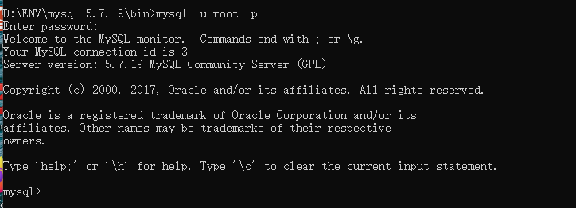

# 初始MySQL

前端（页面：展示，数据）

后台（连接点：连接数据库，连接前端（控制，控制视图跳转，给前端传数据））

数据库（存数据）

## 为什么学习数据库

1、岗位需求

2、大数据时代

3、被迫需求：存数据

4、数据库是所有软件体系中最核心的存在

## 什么是数据库

数据库（DB，DataBase）

概念：数据仓库，==软件==，安装在操作系统（windows，linux，mac）之上的，SQL可以存储大量的数据。（500万以下）

作用：存储数据，管理数据

## 数据库分类

**关系型数据库**：（SQL）

+ MySQL，Oracle，SqlServer，DB2，SQLlite
+ 通过表和表之间，行和列之间的关系进行数据的存储    

**非关系型数据库：**（NoSQL）

+ Redis，MongoDB
+ 非关系型数据库，对象存储，通过对象的自身的属性来决定

==DBMS（数据库管理系统）==

+ 数据库的管理软件，科学有效的管理我们的数据。维护和获取数据
+ MySQL，数据库管理系统

## MySQL简介

MySQL是一个**关系型数据库管理系统**

前世：瑞典MySQL AB公司

今生：属于Oracle旗下产品

MySQL是最好的 [RDBMS](https://baike.baidu.com/item/RDBMS/1048260) (Relational Database Management System，关系数据库管理系统) 应用软件之一。

开源的数据库软件

体积小、速度快、总体拥有成本低

中小型网站或者大型网站，集群！

官网：https://www.mysql.com/

下载：https://downloads.mysql.com/archives/community/

安装建议：

1、尽量不要使用exe，注册表

2、尽可能使用压缩包安装

## windows安装MySQL

彻底删除mysql参考：https://blog.csdn.net/mingtianhaiyouwo/article/details/50387582

```shell
sc delete mysql		# 清空服务
```

1、解压

2、添加环境变量

​	1.我的电脑—属性—高级系统设置—环境变量

​	2.在系统变量里点击path，点击新建：mysql安装文件下面的bin文件夹

3、新建mysql配置文件 ``.ini``结尾

```bash
#my.ini
[mysqld]
# 目录一定要换成自己的，不允许出现中文目录
basedir=D:\ENV\mysql-5.7.19\
datadir=D:\ENV\mysql-5.7.19\data\
port=3306
skip-grant-tables
```

4、==启动管理员模式下的CMD==，并将路径切换到mysql下的bin目录，然后输入``mysqld -install``（安装mysql）


==注意：==这里输入mysqld -install时会报msvcp120.dll失败的问题，解决方案可以参考https://www.cnblogs.com/MXL2020/p/12871203.html

5、再输入`mysqld --initialize-insecure --user=mysql`初始化数据库

会多出一个data目录


6、启动mysql，查看任务管理器有mysql服务正在运行

```bash
net start mysql		#启动服务
```


7、用命令mysql -u root -p进入mysql管理界面（密码可为空）

```shell
mysql -u root -p	# 登录mysql，-p后不要带空格，直接回车，不输密码再次回车
```



8、进入界面后更改root密码（分号结尾）

```bash
update mysql.user set authentication_string=password('123456') where user='root' and Host="localhost";
```


最后输入`flush privileges;`刷新权限


9、最后my.in文件注释最后一句skip-grant-tables

10、重启mysql即可正常使用

```shell
net stop mysql		# 停止服务，查看任务管理器显示mysql服务已停止
```


```shell
net start mysql		# 启动mysql服务
```

11、测试重新连接

```shell
mysql -u root -p123456		# 登录   -p后不加空格
```


## 安装SQLyog


创建数据库


==每一个sqlyog的执行操作，本质就是对应了一个sql，可以在软件的历史记录中查看==

新建一个表

```shell
字段： id ，name，age
```


查看表：右击打开表


插入数据

直接双击表格插入数据，最后点刷新保存


## 连接数据库

命令行连接

```sql
mysql -uroot -p123456	-- 连接数据库

update mysql.user set authentication_string=password('123456') where user='root' and Host="localhost";		-- 修改用户密码

flush privileges	-- 刷新权限
```

## Linux安装数据库(5.7)

yum方式安装mysql5.7

在CentOS中默认安装有MariaDB，这个是MySQL的分支，但为了需要，还是要在系统中安装MySQL，而且安装完成之后可以直接覆盖掉MariaDB。

**1、下载并安装mysql官方的yum repository**

```bash
wget -i -c http://dev.mysql.com/get/mysql57-community-release-el7-10.noarch.rpm
```

使用上面的命令就直接下载了安装用的Yum Repository，大概25KB的样子，然后就可以直接yum安装了。

```bash
yum -y install mysql57-community-release-el7-10.noarch.rpm
```

之后就开始安装MySQL服务器。

```bash
yum -y install mysql-community-server
```

这步可能会花些时间，安装完成后就会覆盖掉之前的mariadb。

**2、MySQL数据库设置**

首先启动mysql

```sql
systemctl start  mysqld
```

查看mysql运行状态

```sql
systemctl status mysqld
```


此时MySQL已经开始正常运行，不过要想进入MySQL还得先找出此时root用户的密码，通过如下命令可以在日志文件中找出密码：

```sql
grep "password" /var/log/mysqld.log
```


如下命令进入数据库：

```sql
mysql -uroot -p
```

输入初始密码，此时不能做任何事情，因为MySQL默认必须修改密码之后才能操作数据库:

```sql
alter user 'root'@'localhost' identified by '123qqq...A';
```

这里有个问题，新密码设置的时候如果设置的过于简单会报错,原因是因为MySQL有密码设置的规范，具体是与validate_password_policy的值有关.

mySQL完整的初始密码规则可以通过如下命令查看：

```sql
show variables like 'validate_password%';
```


重新设置密码规则

```sql
set global validate_password_policy=0;
set global validate_password_length=1;
```

 设置之后就是我上面查出来的那几个值了，此时密码就可以设置的很简单，例如1234之类的。到此数据库的密码设置就完成了。

## 基本命令行操作

```sql
-- 所有的语句都是用；分号 结尾
show databases;		-- 查看所有的数据库
mysql> use mysql;		-- 切换数据库  use 数据库名
Database changed

show tables;	-- 查看数据库中所有的表

describe user；/desc user;		-- 显示数据库中指定表的信息

create database westos;		-- 创建数据库

exit	-- 退出连接

-- 单行注释（sql本身注释）

/*		sql的多行注释
hello
*/
```

数据库四个语言 CRUD 增删改查

DDL	定义语言

DML	操作语言

DQL	查询语言

DCL	控制语言

# 操作数据库

操作数据库>操作数据库中的表>操作数据库中表的数据

==mysql关键字不区分大小写==

## 操作数据库

1、创建数据库

```sql
create database [if not exists] westos;
```


2、删除数据库

```sql
drop database westos;
```

3、使用数据库

```sql
use school
```

4、查看所有数据库

```sql
show databases;
```

## 数据库的列类型

> 数值

+ tinyint	十分小的数据	1个字节
+ smallint      较小的数据    2个字节
+ mediumint    中等大小的数据   3个字节
+ **int               标准的整数     4个字节（常用）**
+ big        较大的数据       8个字节
+ float      浮点数       4个字节
+ double    浮点数     8个字节（精度问题）
+ decimal     字符串形式的浮点数  金融计算的时候，一般是使用decimal

> 字符串

+ char	字符串固定大小的	0~255
+ **varchar     可变字符串     0~65535   **  常用的变量    string

+ tinytext       微型文本      2^8 - 1
+ **text              文本串          2^16 - 1      保存大文本**

> 时间日期

+ date	YYYY-MM-DD，日期格式	
+ time    HH：mm：ss   时间格式
+ **datetime    YYYY-MM-DD HH：mm：ss  最常用的时间格式**
+ **timestamp    时间戳   1970.1.1到现在的毫秒**  也较为常用
+ year    年份表示

> null

+ 没有值，未知
+ ==注意，不要使用NULL进行运算，结果为null==

## 数据库的字段属性（重点）

==Unsigned：==

+ 无符号的整数
+ 声明了该列不能声明为负数

==zerofill：==

+ 0填充的
+ 不足的位数，使用0来填充    int(3)       5---005

==自增：==

+ 通常理解为自增，自动在上一条记录的基础上+1（默认）
+ 通常用来设计唯一的主键，index，必须是整数类型
+ 可以自定义涉及主键自增的起始值和步长

==非空：==NULL not  null

+ 假设设置为 not null，如果不给他赋值，就会报错
+ NULL，如果不填写值，默认就是null

==默认：==

+ 设置默认的值
+ sex，默认为男，如果不指定该列的值，则会有默认的值

拓展：

```sql
--每个表，都必须存在以下五个字段，未来做项目用的，表示一个记录存在意义

id 	主键
version        乐观锁
is_delete      伪删除
gmt_create   创建时间
gmt_update    修改时间
```

## 创建数据库表

```sql
--注意点，使用英文（），表的名称和字段尽量使用``括起来
--AUTO_INCREMENT  自增
--字符串使用单引号括起来
--所有的语句后面加，（英文的），最后一个不用加
--PRIMARY KEY 主键，一般一个表只有一个唯一的主键
CREATE TABLE IF NOT EXISTS `students` (
`id` INT(4) NOT NULL AUTO_INCREMENT COMMENT '学号',
`name` VARCHAR(30) NOT NULL DEFAULT '匿名' COMMENT '姓名',
`pwd` VARCHAR(20) NOT NULL DEFAULT '123456' COMMENT '密码',
`sex` VARCHAR(2) NOT NULL DEFAULT '女' COMMENT '性别',
`birthday` DATETIME DEFAULT NULL COMMENT '出生日期',
`address` VARCHAR(100) DEFAULT NULL COMMENT '家庭住址',
`email` VARCHAR(50) DEFAULT NULL COMMENT '邮箱',
PRIMARY KEY (`id`)
)ENGINE=INNODB DEFAULT CHARSET=utf8

show create database school --查看创建数据库的语句
show create table student  --查看student数据表的定义语句
desc student --显示表的结构
```

格式

```sql
create table [if not exsits] `表名`(
	`字段名` 列类型 [属性][索引][注释]，
)[表类型][字符集设置][注释]
```

## 数据表的类型

```sql
--关于数据库引擎
INNODB 默认使用
MYISAM  早些年使用
```

|              | MYISAM         | INNODB                |
| ------------ | -------------- | --------------------- |
| 事务支持     | 不支持         | 支持                  |
| 数据行锁定   | 不支持（表锁） | 支持行锁定            |
| 外键约束     | 不支持         | 支持                  |
| 全文索引     | 支持           | 不支持                |
| 表空间的大小 | 较小           | 较大，约为MYISAM的2倍 |

常规使用操作：

+ MYISAM	节约空间，速度较快
+ INNODB    安全性高，事务的处理，多表多用户操作

> 在物理空间存在的位置

所有的数据库文件都存在data目录下，一个文件夹就对应一个数据库

本质还是文件的存储


MySQL引擎在物理文件上的区别

+ INNODB   在数据库表中只有一个*.frm文件，以及上级目录下的ibdata1（数据+index）文件

+ MYISAM对应的文件
  - *.frm	表结构的定义文件
  - *.MYD   数据文件（data）
  - *.MYI   索引文件（index）

> 设置数据库表的字符集编码

```sql
CHARSET=utf8
```

不设置的话，会是mysql默认的字符集编码（不支持中文）

MySQL的默认编码是Latin1，不支持中文

在my.ini中配置默认的编码

```sql
character-set-server=utf8
```

查看已有表的使用存储引擎

```sql
--show create table 表名\G;
show create table grade\G;
```


## 修改删除表

> 修改

```sql
--修改表名   ALTER TABLE 旧表名 RENAME AS 新表名
ALTER TABLE students RENAME AS students1
--增加表的字段	ALTER TABLE 表名 ADD age 字段名 属性
ALTER TABLE students1 ADD age INT(3)
--修改表的字段（重命名，修改约束）
--ALTER TABLE 表名 MODIFY 字段名 列属性[]
ALTER TABLE students1 MODIFY age VARCHAR(11)	--修改约束
--ALTER TABLE 表名 CHANGE 旧字段名 新字段名 列属性[]
ALTER TABLE students1 CHANGE age age1 INT(3)	--重命名

chage可以修改字段名称和属性
modify只能修改列属性

--删除表的字段
ALTER TABLE students1 DROP age1
```

> 删除

```sql
--删除表(如果表存在再删除)
DROP TABLE IF EXISTS students1
```

==所有的创建和删除操作尽量加上判断，以免报错==

注意点：

+ `` 字段名使用反单引号包裹
+ 注释--    /**/
+ sql关键字大小写不敏感，建议小写
+ 所有的符号用英文

# MySQL数据管理

## 外键

> 方式一，在创建表的时候，增加约束（麻烦，比较复杂）

```sql
CREATE TABLE `grade`(
`gradeid` INT(10) NOT NULL AUTO_INCREMENT COMMENT '年级id',
`gradename` VARCHAR(50) NOT NULL COMMENT '年级名称',
PRIMARY KEY (`gradeid`)
)ENGINE=INNODB DEFAULT CHARSET=utf8


--学生表的gradeid字段，要引用年级表的gradeid
--定义外键key
--给这个外键添加约束（执行引用）
CREATE TABLE IF NOT EXISTS `student` (
`id` INT(4) NOT NULL AUTO_INCREMENT COMMENT '学号',
`name` VARCHAR(30) NOT NULL DEFAULT '匿名' COMMENT '姓名',
`pwd` VARCHAR(20) NOT NULL DEFAULT '123456' COMMENT '密码',
`sex` VARCHAR(2) NOT NULL DEFAULT '女' COMMENT '性别',
`birthday` DATETIME DEFAULT NULL COMMENT '出生日期',
`gradeid` INT(10) NOT NULL COMMENT '学生的年级id',
`address` VARCHAR(100) DEFAULT NULL COMMENT '家庭住址',
`email` VARCHAR(50) DEFAULT NULL COMMENT '邮箱',
PRIMARY KEY (`id`),
KEY `FK_gradeid`(`gradeid`),
CONSTRAINT `FK_gradeid` FOREIGN KEY (`gradeid`) REFERENCES `grade`(`gradeid`)
)ENGINE=INNODB DEFAULT CHARSET=utf8
```

删除有外键关系的表的时候，必须先删除引用别人的表（从表），再删除被引用的表（主表）

> 方式二：创建表成功后，添加外键约束

```sql
CREATE TABLE `grade`(
`gradeid` INT(10) NOT NULL AUTO_INCREMENT COMMENT '年级id',
`gradename` VARCHAR(50) NOT NULL COMMENT '年级名称',
PRIMARY KEY (`gradeid`)
)ENGINE=INNODB DEFAULT CHARSET=utf8


--学生表的gradeid字段，要引用年级表的gradeid
--定义外键key
--给这个外键添加约束（执行引用）
CREATE TABLE IF NOT EXISTS `student` (
`id` INT(4) NOT NULL AUTO_INCREMENT COMMENT '学号',
`name` VARCHAR(30) NOT NULL DEFAULT '匿名' COMMENT '姓名',
`pwd` VARCHAR(20) NOT NULL DEFAULT '123456' COMMENT '密码',
`sex` VARCHAR(2) NOT NULL DEFAULT '女' COMMENT '性别',
`birthday` DATETIME DEFAULT NULL COMMENT '出生日期',
`gradeid` INT(10) NOT NULL COMMENT '学生的年级id',
`address` VARCHAR(100) DEFAULT NULL COMMENT '家庭住址',
`email` VARCHAR(50) DEFAULT NULL COMMENT '邮箱',
PRIMARY KEY (`id`)
)ENGINE=INNODB DEFAULT CHARSET=utf8

--创建表的时候没有外键关系
ALTER TABLE `student`
ADD CONSTRAINT `FK_gradeid` FOREIGN KEY(`gradeid`) REFERENCES `grade`(`gradeid`);

--alter TABLE 表 ADD CONSTRAINT 约束名 FOREIGN KEY(作为外键的列) REFERENCES 哪个表（哪个字段）
```

```sql
mysql> create table grade( \
    -> gradeid int(10) not null auto_increment comment '年级id',\
    -> gradename varchar(50) not null comment '年级名称', \
    -> primary key (gradeid)\
    -> )ENGINE=INNODB DEFAULT CHARSET=utf8;
    
CREATE TABLE IF NOT EXISTS student1 (
id INT(4) NOT NULL AUTO_INCREMENT COMMENT '学号',
name VARCHAR(30) NOT NULL DEFAULT '匿名' COMMENT '姓名',
pwd VARCHAR(20) NOT NULL DEFAULT '123456' COMMENT '密码',
sex VARCHAR(2) NOT NULL DEFAULT '女' COMMENT '性别',
birthday DATETIME DEFAULT NULL COMMENT '出生日期',
gradeid INT(10) NOT NULL COMMENT '学生的年级id',
address VARCHAR(100) DEFAULT NULL COMMENT '家庭住址',
email VARCHAR(50) DEFAULT NULL COMMENT '邮箱',
PRIMARY KEY (id)
)ENGINE=INNODB DEFAULT CHARSET=utf8;
```

以上的操作都是物理外键，数据库级别的外键，不建议使用 （避免数据库过多造成困扰，这里了解即可）

每次做delete或者update都必须要考虑外键约束，会导致开发的时候很痛苦，测试数据极为不方便

==最佳实践==

+ 数据就是单纯的表，只用来存数据，只有行（数据）和列（字段）
+ 我们想使用多张表的数据，想使用外键（程序去实现）

## *DML语言

**数据库意义**：数据存数，数据管理

DML语言：数据操作语言

+ insert
+ update
+ delete

### 添加

> insert

```sql
--插入语句（添加）
--insert INTO 表名（[字段名1，字段2，字段3]）values('值1'),('值2'),('值3')
INSERT INTO `grade`(`gradename`) VALUES('大四')

-- 由于主键自增我们可以省略(如果不写表的字段，他就会一一匹配)
INSERT INTO `grade` VALUES('大四')
-- 一般写插入语句，我们一定要数据和字段一一对应

--插入多个字段
INSERT INTO `grade`(`gradename`) VALUES('大二'),('大一')

--Linux
INSERT INTO student(name,pwd,sex,gradeid) VALUES('李四','aaaaa','男','1'),('王五','bbbb','男','2')
```

错误总结

```sql
-- 表示在建表的时候没有使用中文编码，所以存不了相应的中文数据
ERROR 1366 (HY000): Incorrect string value: '\xE5\xA4\xA7\xE4\xB8\x80' for column 'gradename' at row 1
```

语法：`insert INTO 表名（[字段名1，字段2，字段3]）values('值1'),('值2'),('值3')`

注意事项：

1、字段和字段之间使用`英文逗号`隔开

2、字段是可以省略的，但是后面的值必须要一一对应，不能少

3、可以同时插入多条数据，VALUES后面的值，需要使用逗号隔开即可，`values (),()...`

### 修改

> update 	修改谁（条件）set 原来的值 = 新值

```sql
--修改学员名字,添加条件
UPDATE `student` SET `name`='李彦彦' WHERE id=1;

--不指定条件的情况下，会改动所有的表
UPDATE `student` SET `name`='泡芙'

UPDATE `student` SET `name`='baby22' WHERE id BETWEEN 2 AND 5;
```

语法：`update 表名 set colnum_name = value where [条件]`

条件：where子句  运算符   id等于某个值，大于某个值，在某个区间内修改..

操作符会返回布尔值

| 操作符       | 含义         | 范围               | 结果  |
| ------------ | ------------ | ------------------ | ----- |
| =            | 等于         | 5=6                | False |
| <>或者！=    | 不等于       | 5<>6               | true  |
| >            | 大于         | 5>6                | False |
| <            | 小于         | 5<6                | True  |
| <=           | 大于等于     | 5>=6               | False |
| >=           | 小于等于     | 5<=6               | True  |
| between..and | 在某个范围内 | [2,5]  包括2,3,4,5 |       |
| and          | 和&&         | 5>1 and 1>2        | False |
| or           | 或者 \|\|    | 5>1 or 1>2         | True  |

```sql
--通过多个条件定位数据
UPDATE `student` SET `name`='长江7号' WHERE `name` ='baby22' AND sex = '女'
```

注意：

+ colnum_name 是数据库的列，在sqlyong中尽量带上``
+ 条件，筛选的条件，如果没有指定，则会修改所有的列
+ value，是一个具体的值，也可以是一个变量

```sql
-- CURRENT_TIMESTAMP  时间变量（显示当前时间）
UPDATE `student` SET `birthday`=CURRENT_TIMESTAMP WHERE `email` = '2236416355@qq.com'
```

+ 多个设置的属性之间，使用英文逗号隔开

### 删除

> delete 命令

语法：`delete from 表名 where[条件]`

```sql
-- 删除数据（避免这样写）
DELETE FROM `student` ;

--删除指定数据
DELETE FROM `student` WHERE id =1;
```

> TRUNCATE命令

作用：完全清空一个数据库表，表的结构和索引约束不会变

```sql
-- 清空student表
TRUNCATE `student`;
```

> delete和truncate区别

+ 相同点：都能删除数据，都不会删除表结构
+ 不同点
  - TRUNCATE   重新设置 自增列 计数器会归零
  - TRUNCATE  不会影响事务

```sql
--测试delete和truncate区别
CREATE TABLE `test`(
`id` INT(4) NOT NULL AUTO_INCREMENT,
`coll` VARCHAR(20) NOT NULL,
PRIMARY KEY(`id`)
)ENGINE=INNODB DEFAULT CHARSET=utf8


INSERT INTO `test`(`coll`) VALUES ('1'),('2'),('3')

DELETE FROM `test`  -- 不会影响自增

TRUNCATE TABLE `test`	-- 自增会归零
```

==delete删除的效果==


重新插入数据自增从4开始


==truncate删除效果==


了解即可：`delete删除的问题`，重启数据库，现象

+ innoDB  自增列会从1开始（存在内存中的，断电即失）
+ MyISAM  继续从上一个自增量开始（存在文件中的，不会丢失）

InnoDB是从现存记录里最大自增量开始，MYISAM是从记录的自增量开始

# **DQL查询数据

### DQL

（Data Query LANGUAGE：数据查询语言）

+ 所有的查询操作都是用   select
+ 简单的查询，复杂的查询都可以做
+ ==数据库中最核心的语言，作重要的语句==
+ 是用频率最高的语言

### 指定查询字段

select完整的语法

```sql
SELECT [ALL | DISTINCT]
{* l table.* l [table.field1[as alias1][,table.field2[as alias2]][,...]]}
FROM table_name [as table_alias]
[left / right / inner join table_name2] --联合查询
[WHERE ...]--指定结果需满足的条件
[GRoUP BY ...]--指定结果按照哪几个字段来分组
[HAVING] --过滤分组的记录必须满足的次要条件，可以和聚合函数一起使用，where不可以
[ORDER BY ...] --指定查询记录按一个或多个条件排序
[LIMIT {[offset, Jrow_count / row_countOFFSET offset}];
 --指定查询的记录从哪条至哪条
```


注意：[ ]括号代表可选的，{ }括号代表必选的

```sql
-- 查询全部的学生    select 字段 From 表
SELECT * FROM student
SELECT * FROM result

-- 查询指定字段
SELECT `studentno`,`studentname` FROM student

-- 别名，给结果起一个名字  AS   可以给字段起别名，也可以给表起别名
SELECT `studentno` AS 学号,`studentname` AS 学生姓名 FROM student AS s

-- 函数 concat(a,b)
SELECT CONCAT ('姓名：',studentname) AS 新名字 FROM student
```

语法：`SELECT 字段，...  FROM 表`

> 有的时候，列名字不是那么的见名知意，起别名   AS      字段名 as 别名    表名 as 别名

> 去重 distinct

作用：去除select查询出来的结果中重复的数据，重复的数据只显示一条

```sql
SELECT * FROM result	-- 查询全部的考试成绩
SELECT `studentno` FROM result 	-- 查询哪些同学参加了考试
-- 发现重复数据，去重
SELECT DISTINCT `studentno` FROM result
```

> 数据库的列（表达式）

```sql
-- 查询系统版本（函数）
SELECT VERSION()
SELECT 100*3-1 AS 计算结果	-- 用来计算(表达式)
SELECT @@auto_increment_increment	-- 查询自增的步长（变量）

-- 学员考试成绩+1分查看
SELECT `studentno`,`studentresult`+1 AS '提分后' FROM result
```

==数据库中的表达式：文本值，列，NULL，函数，计算表达式，系统变量...==

select `表达式` from 表

### where条件子句

作用：检索数据中`符合条件`的值

搜索的条件有一个或多个表达式组成！结果，布尔值

> 逻辑运算符

| 运算符      | 语法                     | 描述                             |
| ----------- | ------------------------ | -------------------------------- |
| and     &&  | a and b       a && b     | 逻辑与，两个都为真，结果为真     |
| or     \|\| | a or b          a \|\| b | 逻辑或，其中一个为真，则结果为真 |
| Not     !   | not a            ! a     | 逻辑非，真为假，假为真           |

==尽量使用英文字母==

```sql
-- ================== where ========================
SELECT studentno,studentresult FROM result

-- 查询考试成绩在95~100分之间
SELECT studentno,studentresult FROM result
WHERE studentresult>=95 AND studentresult<=100

-- and &&
SELECT studentno,studentresult FROM result
WHERE studentresult>=95 && studentresult<=100

-- 模糊查询（区间）
SELECT studentno,studentresult FROM result
WHERE studentresult BETWEEN 95 AND 100

-- 除了1000号学生之外的同学的成绩
SELECT studentno,studentresult FROM result
WHERE studentno!=1000

-- !=   not
SELECT studentno,studentresult FROM result
WHERE  NOT studentno=1000
```

> 模糊查询：比较运算符

| 运算符      | 语法               | 描述                                           |
| ----------- | ------------------ | ---------------------------------------------- |
| IS NULL     | a is null          | 如果操作符为NULL，则结果为真                   |
| IS NOT NULL | a is not null      | 如果操作符为not null,则结果为真                |
| BETWEEN     | a between b and c  | 若a在b和c之间，则结果为真                      |
| **Like**    | a like b           | SQL匹配，如果a 匹配b，则结果为真               |
| **in**      | a in (a1,a2,a3...) | 假设a在a1，或者a2...其中的某一个值中，结果为真 |

```sql
-- ================== 模糊查询 ========================
-- 查询姓刘的同学
-- like结合%（代表0到任意个字符） _(一个字符)
SELECT `studentno`,`studentname` FROM student
WHERE studentname LIKE '张%'

-- 查询姓刘的同学，名字后面只有一个字的
SELECT `studentno`,`studentname` FROM student
WHERE studentname LIKE '张_'

-- 查询姓刘的同学，名字后面只有两个字的
SELECT `studentno`,`studentname` FROM student
WHERE studentname LIKE '张__'

-- 查询名字中间有强字的同学  %强%
SELECT `studentno`,`studentname` FROM student
WHERE studentname LIKE '%强%'

-- ======================== in （具体的一个或多个值）========================
-- 查询1001  1002  10003号学员
SELECT studentno,studentname FROM student 
WHERE studentno IN (1001,1002,1003)

-- 查询在北京的学生
SELECT studentno,studentname FROM student 
WHERE address IN ('北京朝阳','山西临汾')

-- ============= null  not null ==========================
-- 查询地址为空的学生   null  ''
SELECT studentno,studentname FROM student
WHERE address='' AND address IS NOT NULL

-- 查询有出生日期的同学    不为空
SELECT studentno,studentname FROM student
WHERE borndate IS NOT NULL

-- 查询没有出生日期的同学    为空
SELECT studentno,studentname FROM student
WHERE borndate IS NULL
```

### 联表查询

> join 对比


```sql
-- ===============  连表查询 join ================
-- 查询参加了考试的同学（学号，姓名，科目编号，分数）
SELECT * FROM student
SELECT * FROM result

/*
思路
1.分析需求，分析查询的字段来自哪些表（连接查询）
2.确定使用哪种连接查询？7种
确定交叉点（这两个表中哪个数据是相同的）
判断的条件：学生表中studentno=成绩表 studentno
*/

SELECT s.studentno,studentname,subjectno,studentresult
FROM student AS s
INNER JOIN result AS r
WHERE s.studentno=r.studentno

-- Right join
SELECT s.studentno,studentname,subjectno,studentresult
FROM student s
RIGHT JOIN result r
ON s.studentno=r.studentno

-- Left join
SELECT s.studentno,studentname,subjectno,studentresult
FROM student s
LEFT JOIN result r
ON s.studentno=r.studentno
-- left join左连接：展示左表所有数据，右表符合on条件的数据，右表不符合的则显示为空

```

| 操作       | 描述                                         |
| ---------- | -------------------------------------------- |
| Inner join | 如果表中至少有一个匹配，，就返回行           |
| left join  | 会从左表中返回所有的值，即使在右表中没有匹配 |
| right join | 会从右表中返回所有的值，即使在左表中没有匹配 |

```sql
-- ===============  连表查询 join ================
-- 查询参加了考试的同学（学号，姓名，科目编号，分数）
SELECT * FROM student
SELECT * FROM result

/*
思路
1.分析需求，分析查询的字段来自哪些表（连接查询）
2.确定使用哪种连接查询？7种
确定交叉点（这两个表中哪个数据是相同的）
判断的条件：学生表中studentno=成绩表 studentno
*/

SELECT s.studentno,studentname,subjectno,studentresult
FROM student AS s
INNER JOIN result AS r
WHERE s.studentno=r.studentno

-- Right join
SELECT s.studentno,studentname,subjectno,studentresult
FROM student s
RIGHT JOIN result r
ON s.studentno=r.studentno

-- Left join
SELECT s.studentno,studentname,subjectno,studentresult
FROM student s
LEFT JOIN result r
ON s.studentno=r.studentno

-- left join左连接：展示左表所有数据，右表符合on条件的数据，右表不符合的则显示为空

-- 查询缺考的同学
SELECT s.studentno,studentname,subjectno,studentresult
FROM student s
LEFT JOIN result r
ON s.studentno=r.studentno
WHERE studentresult IS NULL

-- join（连接的表） on（判断的条件） 连接查询
-- where   等值查询

-- 思考题（查询参加了考试的同学信息：学号，学生姓名，科目名，分数）

/*
思路
1.分析需求，分析查询的字段来自哪些表  student、result、subject（连接查询）
2.确定使用哪种连接查询？right join  7种
确定交叉点（这两个表中哪个数据是相同的）
判断的条件：学生表中studentno=成绩表 studentno
*/
SELECT s.studentno,studentname,subjectname,studentresult
FROM student s
RIGHT JOIN result r
ON r.studentno=s.studentno
INNER JOIN `subject` sub
ON r.subjectno=sub.subjectno

-- 我要查询哪些数据  select...
-- 从哪几个表中查  from  表  xxx join 连接的表 on 交叉条件
-- 假设存在一种多张表查询，慢慢来，先查询两张表然后再慢慢增加

-- From a left join b
-- From a right join b
```

> 自连接（了解即可）

自己的表和自己的表连接，核心：==一张表拆为两张一样的表即可==


父类

| categoryid | categoryname |
| ---------- | ------------ |
| 2          | 信息技术     |
| 3          | 软件开发     |
| 5          | 美术设计     |
|            |              |

子类

| pid  | categoryid | categoryname |
| ---- | ---------- | ------------ |
| 3    | 4          | 数据库       |
| 2    | 8          | 办公信息     |
| 3    | 6          | web开发      |
| 5    | 7          | ps技术       |

操作：查询父类对应的子类关系

| 父类     | 子类     |
| -------- | -------- |
| 信息技术 | 办公信息 |
| 软件开发 | 数据库   |
| 软件开发 | web开发  |
| 美术设计 | ps技术   |

### 分页和排序

> 排序

```sql
-- ==================分页 limit  和排序  order by ========================
-- 排序：升序ASC  降序DESC
-- ORDER BY 通过哪个字段排序，怎么排
-- 查询的结果根据 成绩降序 排序
SELECT stu.studentno,studentname,subjectname,studentresult
FROM student stu
INNER JOIN result r
ON stu.studentno=r.studentno
INNER JOIN `subject` sub
ON r.subjectno=sub.subjectno
WHERE subjectname='c语言-1'
ORDER BY studentresult ASC
```

> 分页

```sql
-- 100万
-- 为什么要分页？
-- 缓解数据库压力，给人的体验更好，  瀑布流
-- 分页，每页只显示五条数据
-- 网页应用：当前页，总的页数，页面的大小
-- 语法： limit 起始值，每页的条数
-- limit 0,5   1~5
-- limit 1,5   2~6
-- limit 6,5   
SELECT stu.studentno,studentname,subjectname,studentresult
FROM student stu
INNER JOIN result r
ON stu.studentno=r.studentno
INNER JOIN `subject` sub
ON r.subjectno=sub.subjectno
WHERE subjectname='c语言-1'
ORDER BY studentresult ASC
LIMIT 6,5

-- 第一页 limit 0,5   	（1-1）*5
-- 第二页 limit 5,5	（2-1）*5
-- 第三页 limit 10,5	（3-1）*5
-- 第N页 limit 5,5	（n-1）*pagesize
-- [pagesize:页面大小]
-- [（n-1）*pagesize起始值]
-- [n:当前页]
-- [数据总数/页面大小=总页数]	总页数取整
```

语法：`limit (查询起始下标，pagesize)`

综合案例

```sql
-- 查询 高等数学-1 课程成绩排名前十的学生，并且分数要大于80的学生信息（学号，姓名，课程名称，分数）
SELECT stu.studentno,studentname,subjectname,studentresult
FROM student stu
INNER JOIN result r
ON stu.studentno=r.studentno
INNER JOIN `subject` sub
ON r.subjectno=sub.subjectno
WHERE subjectname='高等数学-1' AND studentresult>=80
ORDER BY studentresult DESC
LIMIT 0,10
```

### 分组和过滤

```sql
-- 查询不通课程的平均分，最高分，最低分
-- 核心：（根据不同的课程分组）
SELECT any_value(subjectname),AVG(studentresult) AS 平均分,MAX(studentresult) AS 最高分,MIN(studentresult) AS 最低分
FROM result r
INNER JOIN `subject` s
ON r.subjectno=s.subjectno
GROUP BY r.subjectno   -- 通过什么字段来分组
HAVING 平均分>80
```

### select小结


淘宝千人千面

### 子查询

where（这个值是计算出来的）

本质：`在where语句中嵌套一个子查询语句`

where(select * from)

```sql
-- 1、查询高等数学-1 的所有考试结果（学号，科目编号，成绩），降序排列
-- 方式一：使用连接查询
SELECT studentno,r.subjectno,studentresult
FROM result r
INNER JOIN `subject` s
ON r.subjectno=s.subjectno
WHERE subjectname='高等数学-1'
ORDER BY studentresult DESC

-- 方式二：使用子查询（由里及外）
SELECT studentno,subjectno,studentresult
FROM result
WHERE subjectno=(
	SELECT subjectno FROM `subject` WHERE subjectname='高等数学-1'
)
ORDER BY studentresult DESC

-- 查询所有 高等数学-1 的科目编号
SELECT subjectno FROM `subject` WHERE subjectname='高等数学-1'


-- 查询课程为  高等数学-2 且分数不小于60分的同学的学号和姓名
SELECT s.studentno,studentname
FROM student s
INNER JOIN result r
ON s.studentno=r.studentno
INNER JOIN `subject` sub
ON r.subjectno=sub.subjectno
WHERE subjectname='高等数学-2' AND studentresult>=60

-- 分数不小于60分的学生的学号和姓名
SELECT DISTINCT s.studentno,studentname
FROM student s
INNER JOIN result r
ON s.studentno=r.studentno
WHERE studentresult>=80

-- 在这个基础上增加一个科目，高等数学-2
SELECT DISTINCT s.studentno,studentname
FROM student s
INNER JOIN result r
ON s.studentno=r.studentno
WHERE studentresult>=60 AND subjectno=(
	SELECT subjectno FROM `subject` WHERE subjectname='高等数学-2'
)

-- 查询高等数学-2的编号
SELECT subjectno FROM `subject` WHERE subjectname='高等数学-2'

-- 再改造(由里及外)
SELECT DISTINCT studentno,studentname FROM student WHERE studentno IN (
	SELECT studentno FROM result WHERE studentresult>60 AND subjectno = (
		SELECT subjectno FROM `subject` WHERE subjectname='高等数学-2'
	)
)

-- 查询c语言-1前五名同学的成绩的信息（学号，姓名，分数）
SELECT DISTINCT s.studentno,studentname,studentresult 
FROM student s
INNER JOIN result r
ON s.studentno=r.studentno
INNER JOIN `subject` sub
ON r.subjectno=sub.subjectno
WHERE subjectname='c语言-1'
ORDER BY studentresult DESC
LIMIT 0,5
```

# MySQL函数

5.7官方文档：[MySQL :: MySQL 5.7 Reference Manual :: 12.1 SQL Function and Operator Reference](https://dev.mysql.com/doc/refman/5.7/en/sql-function-reference.html)

#### 常用函数

```sql
-- 数学运算
SELECT ABS(-8)  -- 绝对值
SELECT CEILING(9.4)   -- 向上取整
SELECT FLOOR(9.4)   -- 向下取整
SELECT RAND()	-- 返回0~1之间的随机数
SELECT SIGN(10)	-- 判断一个数的符号  负数返回-1  正数返回1   0返回0

-- 字符串函数
SELECT CHAR_LENGTH('即使再小的帆也能远航')	-- 字符串长度
SELECT CONCAT('我','爱','你们')			-- 拼接字符串
SELECT INSERT('我爱编程helloworld',2,3,'超级热爱')		-- 查询，从某个位置开始替换长度  (2:需要替换的位置，3:需要替换的长度)  如果将3替换为0就是插入
SELECT LOWER('LiYanYan')	-- 转小写
SELECT UPPER('LiYanYan')	-- 转大写
SELECT INSTR('LiYanYan','Y')	-- 返回第一次出现的子串的索引
SELECT REPLACE('坚持就能成功','坚持','努力')	-- 替换出现的指定字符串
SELECT SUBSTR('鲁迅说坚持就能成功',4,3)		-- 返回指定的子字符串('原字符串',截取位置，截取长度)
SELECT REVERSE('鲁迅说坚持就能成功')	-- 反转

-- 查询姓周的同学，名字邹
SELECT REPLACE(studentname,'周','邹') FROM student WHERE studentname LIKE '周%'

-- 时间和日期函数(重要)
SELECT CURRENT_DATE() -- 获取当前日期
SELECT CURDATE()  -- 获取当前日期
SELECT NOW()	-- 获取当前时间
SELECT LOCALTIME()	-- 本地时间
SELECT SYSDATE()	-- 系统时间
SELECT DATE_FORMAT(NOW(),'%b %d %Y %h:%i %p')	-- 以不同的格式显示日期/时间数据 参考https://www.w3school.com.cn/sql/func_date_format.asp
SELECT YEAR(NOW())
SELECT MONTH(NOW())
SELECT DAY(NOW())
SELECT HOUR(NOW())
SELECT MINUTE(NOW())
SELECT SECOND(NOW())

-- 系统
SELECT SYSTEM_USER()
SELECT USER()
SELECT VERSION()

```

#### 聚合函数（常用）

| 函数名称 | 描述   |
| -------- | ------ |
| count()  | 计数   |
| sum()    | 求和   |
| avg()    | 平均值 |
| max()    | 最大值 |
| min()    | 最小值 |
| ...      |        |

```sql
-- 都能够统计表中的数据（想查询一个表中有多少个记录，就是用这个count（））
SELECT COUNT(borndate) FROM student  -- count(字段)，会忽略所有的null值，有主键的时候使用
SELECT COUNT(*) FROM student  -- count(*)，不会忽略所有的null值，本质计算行数，计算所有列
SELECT COUNT(1) FROM student  -- count(*)，不会忽略所有的null值，本质计算行数，计算一列

SELECT SUM(studentresult) AS 总和 FROM result
SELECT AVG(studentresult) AS 平均分 FROM result
SELECT MAX(studentresult) AS 最高分 FROM result 
SELECT MIN(studentresult) AS 最低分 FROM result

-- 查询不通课程的平均分，最高分，最低分
-- 核心：（根据不同的课程分组）
SELECT any_value(subjectname),AVG(studentresult) AS 平均分,MAX(studentresult) AS 最高分,MIN(studentresult) AS 最低分
FROM result r
INNER JOIN `subject` s
ON r.subjectno=s.subjectno
GROUP BY r.subjectno   -- 通过什么字段来分组
HAVING 平均分>80
```

#### 数据库级别的MD5加密（扩展）

什么是MD5？

主要增强算法复杂度和不可逆性

MD5不可逆，具体的值的md5是一样的

MD5破解网站的原理，背后有一个字典，MD5加密后的值 ，加密前的值

```sql
-- =================  测试md5加密 ================
CREATE TABLE `testmd5`(
	id INT(4) NOT NULL,
	`name` VARCHAR(20) NOT NULL,
	pwd VARCHAR(50) NOT NULL,
	PRIMARY KEY(`id`)
)ENGINE=INNODB DEFAULT CHARSET=utf8

-- 明文密码
INSERT INTO testmd5 VALUES(1,'zhangsan','123456'),(2,'lisi','123456'),(3,'wangwu','123456')

-- 加密
UPDATE testmd5 SET pwd=MD5(pwd) WHERE id=1

UPDATE testmd5 SET pwd=MD5(pwd)	-- 加密全部的密码

-- 插入的时候加密
INSERT INTO testmd5 VALUES(4,'xiaoming',MD5('123456'))

-- 如何校验：将用户传递进来的密码，进行md5加密，然后对比加密后的值
SELECT * FROM testmd5 WHERE `name`='xiaoming' AND pwd=MD5('123456')

-- 校验过程
DELETE FROM testmd5 WHERE `name`='xiaoming'
INSERT INTO testmd5 VALUES(4,'xiaoming',MD5('123456'))
SELECT * FROM testmd5 WHERE `name`='xiaoming' AND pwd=MD5('123456')
```

# 事务

## 什么是事务

==要么都成功，要么都失败==

一一一一一一一一一一

1. SQL执行	A 给B 转账    	A  1000   --------->  200     B   200 
2. SQL执行    B收到A的钱       A  800     B    400

一一一一一一一一一一

将一组SQL放在一个批次中去执行

InnoDB


> 事务原则：ACID原则 【原子性，一致性，隔离性，持久性】   （脏读，幻读）

参考博客链接：[事务ACID理解_dengjili的专栏-CSDN博客_事务acid](https://blog.csdn.net/dengjili/article/details/82468576)

**原子性（Atomicity）**

要么都成功，要么都失败

**一致性（Consistency）**

事务前后的数据完整性要保持一致

**隔离性（Isolation）**

事务的隔离性是多个用户并发访问数据库时，数据库为每一个用户开启的事务，不能被其他事务的操作数据所干扰，多个并发事务之间要相互隔离。

四种隔离级别：[数据库事务隔离的四个级别_小八成长记-CSDN博客_事务隔离的四个级别](https://blog.csdn.net/A1174316452/article/details/109442748)

**持久性（Durability）**--事务提交

事物一旦提交则不可逆，被持久化到数据库中

> 隔离所导致的一些问题

**脏读**

指一个事务读取了另外一个事务未提交的数据

**不可重复读**

在一个事务内读取表中的某一行数据，多次读取结果不同。（这个不一定是错误，只是某些场合不对）

**虚读（幻读）**

是指在一个事务内读取到了别的事务插入的数据，导致前后读取不一致。
（一般是行影响，多了一行）

> 执行事务

```sql
-- =============== 事务 ==================

-- mysql 是默认开启事务自动提交的
SET autocommit = 0  -- 关闭
SET autocommit = 1  -- 开启（默认的）

-- 手动处理事务
SET autocommit = 0  -- 关闭自动提交
-- 事务开启
START TRANSACTION	-- 标记一个事务的开始，从这个之后的sql都在同一个事务内

INSERT 
INSERT

-- 提交：持久化
COMMIT
-- 回滚
ROLLBACK
-- 事务结束
SET autocommit = 1 -- 开启自动提交 

SAVEPOINT  保存点名  -- 设置一个事务的保存点
ROLLBACK TO SAVEPOINT 保存点名
RELEASE SAVEPOINT 保存点名 -- 撤销保存点
```


> 模拟场景

```sql
-- 转账
CREATE DATABASE shop CHARACTER SET utf8 COLLATE utf8_general_ci
USE shop

CREATE TABLE account(
	id INT(3) NOT NULL AUTO_INCREMENT,
	`name` VARCHAR(30) NOT NULL,
	money DECIMAL(9,2) NOT NULL,
	PRIMARY KEY (id)
)ENGINE=INNODB DEFAULT CHARSET=utf8

INSERT INTO account(`name`,`money`) VALUES
('A',2000.00),('B',10000.00)

-- 模拟转账：事务
SET autocommit =0; -- 关闭自动提交
START TRANSACTION -- 开启一个事务
UPDATE account SET money=money-500 WHERE `name`='A'  -- A减500
UPDATE account SET money=money+500 WHERE `name`='B'  -- B加500

COMMIT;  -- 提交事务，就被持久化了，无法回滚
ROLLBACK; -- 回滚

SET autocommit = 1;  -- 恢复默认值

```

# 索引

> MySQL官方对索引的定义为：**索引（Index）是帮助MySQL高效获取数据的数据结构。**
>
> 提取句子主干，就可以得到索引的本质：索引是数据结构。

## 索引的分类

> 在一个表中，主键索引只能有一个，唯一索引可以有多个

+ 主键索引（PRIMARY KEY）
  - 唯一的标识，主键不可重复，只能有一个列作为主键，自带唯一和为空约束
+ 唯一索引（UNIQUE KEY）
  - 避免重复的列出现，唯一索引可以重复，一个表中可以标识多个唯一索引
+ 常规索引（KEY/INDEX）
  - 默认的，index key关键字来设置
+ 全文索引（FullText）
  - 在特定的数据库引擎下才有，MYISAM
  - 快速定位数据

基础语法

```sql
-- ============索引============
-- 在创建表的时候给字段增加索引
-- 创建完毕后，增加索引

-- 显示所有的索引信息
SHOW INDEX FROM student

-- 增加一个全文索引
ALTER TABLE school.student ADD FULLTEXT INDEX studentname(studentname)

-- EXPLAIN 分析sql执行的状况
EXPLAIN SELECT * FROM student -- 非全文索引

EXPLAIN SELECT * FROM student WHERE MATCH(studentname) AGAINST('张')
```

## 测试索引

```sql
-- 创建表
CREATE TABLE `app_user` (
`id` BIGINT(20) UNSIGNED NOT NULL AUTO_INCREMENT,
`name` VARCHAR(50) DEFAULT'' COMMENT'用户昵称',
`email` VARCHAR(50) NOT NULL COMMENT'用户邮箱',
`phone` VARCHAR(20) DEFAULT'' COMMENT'手机号',
`gender` TINYINT(4) UNSIGNED DEFAULT '0'COMMENT '性别（0：男;1:女）',
`password` VARCHAR(100) NOT NULL COMMENT '密码',
`age` TINYINT(4) DEFAULT'0'  COMMENT '年龄',
`create_time` DATETIME DEFAULT CURRENT_TIMESTAMP,
`update_time` TIMESTAMP NOT NULL DEFAULT CURRENT_TIMESTAMP ON UPDATE CURRENT_TIMESTAMP,
PRIMARY KEY (`id`)
) ENGINE=INNODB DEFAULT CHARSET=utf8 COMMENT = 'app用户表'

-- 插入100万数据
DELIMITER $$  -- 写函数之前必须要写，标志

CREATE FUNCTION mock_data()
RETURNS INT
BEGIN
  DECLARE num INT DEFAULT 1000000;
  DECLARE i INT DEFAULT 0;
  WHILE i<num DO
	-- 插入语句
	INSERT INTO app_user(`name`,`email`,`phone`,`gender`,`password`,`age`)VALUES(CONCAT('用户',i),'2236416355.qq.com',
        CONCAT('18',FLOOR(RAND()*((999999999-100000000)+100000000))),FLOOR(RAND()*2),UUID(),FLOOR(RAND()*100));
	SET i = i+1;
  END WHILE;
  RETURN i;
END;


INSERT INTO app_user(`name`,`email`,`phone`,`gender`,`password`,`age`)
VALUES(CONCAT('用户',i),'2236416355.qq.com',
CONCAT('18',FLOOR(RAND()*((999999999-100000000)+100000000))),
FLOOR(RAND()*2),UUID(),FLOOR(RAND()*100))


SELECT mock_data();

SELECT * FROM app_user WHERE `name`='用户9999'  -- 用时 1.098s
SELECT * FROM app_user WHERE `name`='用户9999'  -- 用时 0.093s
SELECT * FROM app_user WHERE `name`='用户9999'  -- 用时 0.788s

EXPLAIN SELECT * FROM app_user WHERE `name`='用户9999' 

-- 添加索引
-- id_表名_字段名
-- CREATE INDEX 索引名 on 表（字段）
CREATE INDEX id_app_user_name ON app_user(`name`)
SELECT * FROM app_user WHERE `name`='用户9999'  -- 创建索引之后用时 0.001s
EXPLAIN SELECT * FROM app_user WHERE `name`='用户9999' 

-- 删除索引
drop index id_app_user_name on app_user(`name`)
```

创建索引之前查看执行的状况


创建索引之后查看执行状况（效率高）


==索引在小数据量的时候用处不大，但是在大数据的时候，区别十分明显~==

## 索引原则

+ 索引不是越多越好
+ 不要对经常变动的数据加索引
+ 小数据量的表不需要加索引
+ 索引一般加在常用来查询的字段上

> 索引的数据结构

Hash类型的索引

Btree：InnoDB的默认数据结构

阅读：[CodingLabs - MySQL索引背后的数据结构及算法原理](http://blog.codinglabs.org/articles/theory-of-mysql-index.html)

# 

# 权限管理和备份

## 用户管理

> SQLyog 可视化管理


> SQL命令操作

用户表：mysql.user

本质：对这张表进行增删改查

```sql
-- 创建用户 create user 用户名 identified by '密码'
CREATE USER lyy IDENTIFIED BY '123456'

-- 修改密码(修改当前用户密码)
SET PASSWORD=PASSWORD('111111')

-- 修改密码(修改指定用户密码)
SET PASSWORD FOR lyy = PASSWORD('111111')

ALTER USER "lyy"@"%" IDENTIFIED BY '123456';

-- 重命名
-- rename user 原名字 to 新名字
RENAME USER lyy TO lyy2

-- 用户授权 grant all privileges 全部的权限，库.表
-- all privileges 除了给别人授权，其他都有权限
GRANT ALL PRIVILEGES ON *.* TO lyy2

-- 查询权限
SHOW GRANTS FOR lyy2	-- 查看指定用户的权限
SHOW GRANTS FOR root@localhost

-- root用户的权限：GRANT ALL PRIVILEGES ON *.* TO 'root'@'localhost' WITH GRANT OPTION

-- 撤销权限 revoke 哪些权限 ，在哪个库撤销，给谁撤销
REVOKE ALL PRIVILEGES ON *.* FROM lyy2

-- 删除用户
DROP USER lyy2
```

## MySQL备份

为什么要备份：

+ 保证重要的数据不丢失
+ 数据转移

MySQL数据库备份的方式

+ 直接拷贝物理文件（data文件）
+ 在Sqlyog这种可视化工具中手动导出
  - 在想要导出的表或者库中，右键，选择备份或导出（备份表作为SQL转储）
    
+ 使用命令行导出  mysqldump  命令行使用

```sql
-- mysqldump -h 主机 -u 用户 -p密码 数据库 表名 > 路径/文件名
mysqldump -hlocalhost -uroot -p111111 school student > test.sql

-- mysql -h 主机 -u 用户 -p密码 数据库 表1 表2 表3 > 路径/文件名
mysqldump -hlocalhost -uroot -p111111 school student result > test1.sql

-- mysql -h 主机 -u 用户 -p密码 数据库> 路径/文件名
mysqldump -hlocalhost -uroot -p111111 school > test2.sql
```

导入数据

```sql
-- 导入
-- 登录的情况下，切换到指定的数据库
source 路径/备份文件

-- 未登录情况下
-- mysql -u用户名 -p密码 库名 < 路径/备份文件
mysql -uroot -p111111 school < test.sql
```

假设你要备份数据库，防止数据丢失，sql文件发给别人即可

# 规范数据库设计（重要）

## 为什么需要设计

==当数据库比较复杂的时候，我们就需要设计了==

**糟糕数据库设计：**

+ 数据冗余，浪费空间
+ 数据插入和删除会比较麻烦、异常【屏蔽使用物理外键】
+ 程序的性能差

**良好的数据库设计：**

+ 节省内存空间
+ 保证数据库的完整性
+ 方便我们开发系统

**软件开发中，关于数据库的设计**

+ 分析需求，分析业务和需要处理的数据库的需求
+ 概要设计：设计关系图  E-R图


**设计数据库的步骤：（个人博客）**

+ 收集信息，分析需求
  - 用户表（用户登录注销，用户的个人信息，写博客，创建分类）
  - 分类表（文章分类，谁创建的）
  - 文章表（文章的信息）
  - 评论表
  - 友链表（友链信息）
  - 自定义表（系统信息，某个关键的字或者一些主题） key：value
  - 说说表（发表心情......id...content......create_time）

+ 标识实体（把需求落地到每个字段）
+ 标识实体之间的关系
  - 写博客：user--->blog
  - 创建分类：user--->category
  - 关注：user--->user
  - 友链：links
  - 评论：user-user-blog

## 三大范式

**为什么需要数据规范化**

+ 信息重复
+ 更新异常
+ 插入异常
  - 无法正常显示信息
+ 删除异常
  - 丢失有效的信息

> 三大范式（了解）

参考文章：[关系型数据库设计：三大范式的通俗理解 - 景寓6号 - 博客园 (cnblogs.com)](https://www.cnblogs.com/wsg25/p/9615100.html)

**第一范式（1NF）**

原子性：保证每一列不可再分

**第二范式（2NF）**

前提：满足第一范式

每张表只描述一件事情

**第三范式（3NF）**

前提：满足第一范式和第二范式

第三范式需要确保数据表中的每一列数据都和主键直接相关，而不能间接相关


（规范数据库的设计）


**规范性和性能的问题**

关联查询的表不得超过三张表

+ 考虑商业化的需求和目标（成本，用户体验）数据库的性能更加重要
+ 在规范性能的问题的时候，需要适当的考虑一下规范性
+ 故意给某些表增加一些冗余的字段（从多表查询中变为单表查询）
+ 故意增加一些计算列（从大数据量降低为小数据量的查询：索引）

>  SQL注入问题

sql存在漏洞，会被攻击导致数据泄露 ==sql会被拼接  or==

```sql
-- sql语句可以获取表里的所有数据
select * from users where name='' or '1=1' and password='' or '1=1'
```

