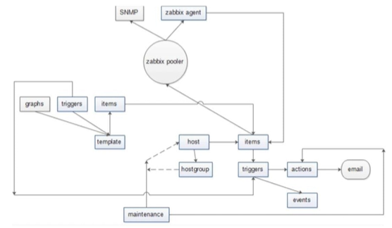
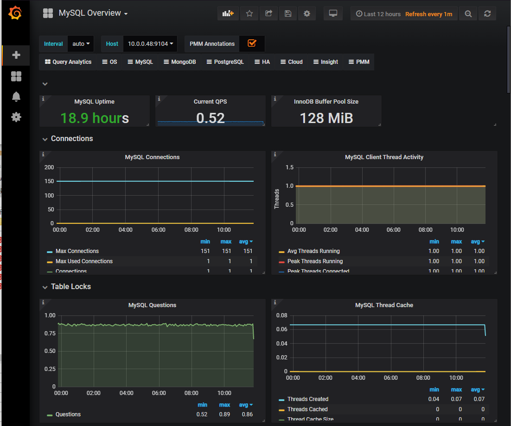
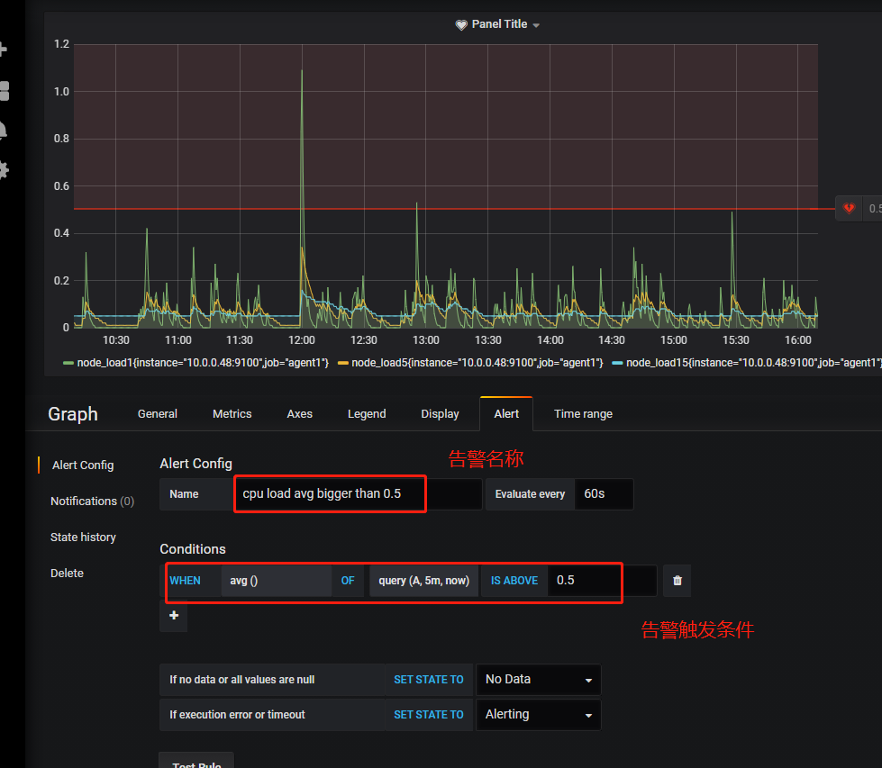

# Promethus（普罗米修斯）监控系统

# 学习目标

+ 能够安装prometheus服务器
+ 能够通过安装node_exporter监控远程linux
+ 能够通过安装mysqld_exporter监控远程mysql数据库
+ 能够安装grafana
+ 能够在grafana添加prometheus数据源
+ 能够在grafana添加监控cpu负载的图形
+ 能够在grafana图形显示mysql监控数据
+ 能够通过grafana+onealert实现报警

# 任务背景

某某某公司是一家电商网站，由于公司的业务快速发展，公司要求对现有机器惊醒业务监控，责成运维部门来实施这个项目

# 任务要求

1）部署监控服务器，实现7x24实时监控

2）针对公司的业务及研发部门设计监控系统，对监控项的触发器拿出合理意见

3）做好问题预警机制，对可能出现的问题要及时告警并形成严格的处理机制

4）做好监控告警系统，要求可以实现告警分级

一级报警	电话通知

二级报警	微信通知

三级报警	邮件通知

5）处理好公司服务器异地集中监控问题，k8s内部使用的监控系统就是普罗米修斯

# 任务分析

>  为什么要监控？

实时手机数据，通过报警及时发现问题，及时处理。为数据优化提供依据

> 监控四要素

+ 监控对象					[主机状态  服务  资源  页面  url]
+ 用什么监控                [zabbix-server   zabix-agent] =>普罗米修斯
+ 什么时间监控            [7x24    5x8]
+ 报警给谁                   [管理员]

> 项目选型

+ **mrtg**  (Multi Router Traffic Grapher)

  通过snmp协议得到设备的流量信息，并以包含PNG格式的图形的HTML文档方式显示给用户

+ **cacti**（仙人掌）

  基于php，mysql，snmp及rrdtool开发的==网络流量监测图形分析工具==。用php语言实现的一个软件，它的主要功能是用snmp服务获取数据，然后用rrdtool储存和更新数据。官网地址：https://www.cacti.net

  

  > 优点

  机房、流量监控方面应用较广泛

  > 缺点

  报警比较简陋

+ **ntop**  

  官网地址：https://www.ntop.org

+ **nagios**  

  能够跨平台，插件多，报警功能强大。官网地址：https://www.nagios.org
  它是一款免费的开源IT基础设施监控系统

  

  > 优点

  安装插件和编写监控脚本，用户可以实现应用监控，自定义的灵活度较高

  > 缺点

  无法查询历史数据

+ **centreon**  
  底层使用的就是nagios。是一个nagios整合版软件。官网地址：https://www.centreon.com

+ **ganglia** 
  设计用于测量数以千计的节点的基础性能和流量使用情况，资源消耗非常小。官网地址：http://ganglia.info

  

  > 优点

  部署方便，用不同分层管理上万台机器，无需逐个添加配置；

  ganglia服务端能通过一台客户端收集同一个网段的所有客户端的数据；

  ganglia集群服务端能够通过一台服务端收集到它下属的所有客户端数据

  > 缺点

  没有内置的消息系统，无法报警

+ **OpenFalcon** 
  小米发布的运维监控软件，高效率，高可用。时间较短，用户基数小。是一款企业级、高可用、高扩展的开源监控解决方案。官网地址：http://open-falcon.org     c/s架构

  

  > 优点

  每秒采集百万次千万次的数据，同时提供历史数据存储和查询

+ **==zabbix==** 
  是一个企业级的分布式开源监控方案。跨平台，画图，多条件告警，多种API接口。使用基数特别大。官网地址：https://www.zabbix.com    c/s架构

  

+ **==prometheus==** 
  新一代的云原生监控系统。基于时间序列的数值数据的容器监控解决方案。官网地址：https://prometheus.io

==综合分析：Prometheus比较适合公司的监控需求==

|      | zabbix                                                       | openfalcon                                                   | prometheus                                                   |
| ---- | ------------------------------------------------------------ | ------------------------------------------------------------ | ------------------------------------------------------------ |
| 优点 | 1、支持多平台的企业级分布式开源监控软件<br />2、安装部署简单,多种数据采集插件灵活集成<br />3、功能强大，可实现复杂多条件告警<br/>4、自带画图功能,得到的数据可以绘成图形<br />5、提供多种API接口，支持调用脚本<br/>6、出现问题时可自动远程执行命令(需对agent设置执行权限) | 1、自动发现，支持falcon-agent. snmp、支持用户主动push、用户自定义插件支持，接入灵活<br />2、支持每个周期上亿次的数据采集、告警判定、历史数据存储和查询，承载量大<br/>3、高效的portal、支持策略模板、模板继承和覆盖、多种告警方式、支持callback调用<br/>4、单机支撑200万metric的上报、归档、存储<br/>采用rrdtool的数据归档策略，秒级返回上百个metric一年的历史数据<br/>5、多维度的数据展示，用户自定义Screen | 1、后端用golang开发，前端是Grafana，JSON编辑即可解决。定制化难度较低<br/>2、监控数据存储在基于时间序列的数据库内，便于对已有数据进行新的聚合。<br/>3、各个组件都有较成熟高可用方案，没有单点故障<br/>4、适合对云环境进行监控，对OpenStack,Kubernetes有很好的集成。<br/>5、支持报警的收敛 |
| 缺点 | 1、项目批量修改不方便<br/>2、但是深层次需求需要非常熟悉Zabbix并进行大量的二次定制开发。难度较大<br/>3、系统级别报警设置相对比较多。如果不筛选的话报警邮件会很多;并且自定义的项目报警需要自己设置,过程比较繁琐<br/>4、数据报表需要特殊二次开发定义; | 1、社区支持不够完善<br />2、有些基础软件监控不支持（tomcat、apache），功能有待完善 | 1、安装相对复杂，监控、告警和界面都分属于不同的组件。<br/>2、界面相对较弱，很多配置需要修改配置文件。 |

# 一、使用机器方法演变/监控选型

> 最初人们直接使用物理机，将进程直接跑在物理机上面


+ **优点**：安装完系统就能直接用，最简单的使用方法
+ **缺点**：进程间无法隔离，会互相应影响

从监控的角度考虑：监控起来最方便，复杂度最低

> 后来人们开始使用虚拟机


+ **优点**：及其资源得到了更高效的利用，也实现了进程隔离
+ **缺点**：虚拟机本身有操作系统的消耗，一台物理机，生产环境中最小也要给虚拟机分配1核2G的资源

从监控角度来讲：相对比较复杂，我们要知道哪台机器上跑了哪些虚拟机，同时还要知道每个虚拟机里面跑了什么程序

> docker的出现


+ 优点：更轻量，在成本在资源消耗上更具有优势，一台物理机可以跑上百个docker

  例如: docker run --rm --name test01 -m 500M --cpu-cpus 1 --cpu-quota=XXXX

+ 缺点：监控起来复杂度非常高，我们要知道每台机器上跑了哪些docker，和每个docker的资源使用情况（很难用静态的方法去监控）

Docker又不是独立的，一般使用docker的同时还会使用一些工具来做编排：比如apache mesos、swarm、k8s等等

根据Google搜索引擎提供的数据，Kubernetes的热度已远超同时期的其他容器平台

# 二、普罗米修斯概述

+ 2016年,Prometheus加入了云计算基金会，成为kubernetes之后的第二个托管项目
+ google SRE的书内也曾提到跟他们BorgMon监控系统相似的实现是Prometheus。
+ 现在最常见的Kubernetes容器管理系统中，通常会搭配Prometheus进行监控。

Prometheus（由go语言golang开发）是一套开源的监控&报警&时间序列数据库的组合。适合监控docker容器。因为Kubernetes的流行带动了prometheus的发展

官方网站：https://prometheus.io/docs/introduction/overview/

## prometheus能做什么

+ Prometheus原生支持上面提到的各种工具的监控
+ 其他监控软件这方面目前做的不够完善，许多功能要自己开发
+ 强大的功能，除了云平台之外，还支持主机、各种db资源、web网站、dns、网络延时、端口连通性、各种语言写的程序监控等（除了云平台监控还支持基础监控）
+ 良好的性能：单机单实例支持数十万监控项/每秒
+ 高可用的架构：核心组件都有高可用解决方案
+ 强大的查询能力：自带查询语言
+ 成熟的社区和健全的生态

> 总结

Prometheus并不是最好的监控系统，选择它的主要原因是他对云环境的原生支持

恰好现在云环境是当前最火，应用最广泛的解决方案

监控是应用于服务的，不通的服务场景选择不同的监控软件，切勿盲从

如果环境只是虚拟机或者物理机，可以选择使用zabbix或者openfalcon

# 三、Prometheus基本原理

## 时间序列数据库（TSDB）

### 1、什么是时间序列数据

**时间序列数据**（Time Series Data）：按照时间顺序记录系统、设备状态变化的数据被称为时序数据

+ 用于保存时间序列（按时间顺序变化）的数据
+ 每条记录都有完整的时间戳，基于时间的操作都比较方便

应用的场景很多，如：

+ 无人驾驶车辆运行中要记录的经度，纬度，速度，方向，旁边物体的距离等等。每时每刻都要将数据记录下来做分析。
+ 某一个地区的各车辆的行驶轨迹数据
+ 传统证券行业实时交易数据     股票走势图
+ 实时运维监控数据等

### 2、时间序列数据特点

+ 性能好

关系型数据库对于大规模数据的处理性能糟糕。NOSQL可以比较好的处理大规模数据，但依然比不上时间序列数据库

+ 存储成本低

高效的压缩算法，节省存储空间，有效降低IO

Prometheus有着非常高效的时间序列数据存储方法，每个采样数据仅仅占用3.5byte左右空间，上百万条时间序列，30秒间隔，保留60天，大概花了200多G（来自官方数据）

+ 时间作为他的主轴，数据按顺序到达
+ 大多数操作是插入新数据，偶尔伴随查询，更新数据比较少
+ 时间序列数据累计速度非常快，更高的容纳率、更快的大规模查询以及更好的数据压缩
+ TSDB通常还包括一些共通的对时间序列数据分析的功能和操作：数据保留策略、灵活的时间聚合等

## Prometheus的主要特征

+ 多维度数据模型
+ 灵活的查询语言
+ 不依赖分布式存储，单个服务器节点是自主的
+ 以HTTP方式，通过pull模型拉取时间序列数据
+ 也可以通过中间网关支持push模型
+ 通过服务发现或者静态配置，来发现目标服务对象
+ 支持多种多样的图标和界面展示

## 普罗米修斯原理架构图


>  工作过程

+ 数据来源是一些官方的exporter或自定义sdk或接口


+ Server通过http的pull方式采集监控数据，并在本地存储到tsdb中

+ 不能直接网络互通的原数据可以通过pushgateway组件代理，已实现数据收集
+ tsdb有自带的查询语言promql，可以查询监控数据
+ 报警方式是通过promql写规则，与你设置的阈值进行匹配，超过阈值报警，这个组件也是独立的，alertmanager
+ Server同时提供了简单的ui，可以查看配置查询数据，当然通常的展示借助第三方插件比如grafana

**数据源暴露http接口，Server每隔一段时间去拉取，不方便直接拉取的数据，客户端主动上报到pushgateway组件，Server端定时从pushgateway组件统一拉取**

## Prometheus组件介绍

### prometheus-server

```shell
--config.file=						# 指定配置文件
--storage.tsdb.path=/prometheus		# 指定tsdb存储路径 硬盘最好是ssd硬盘
--storage.tsdb.retention.time=24h	# 指定数据存储时间
--web.enable-lifecycle				# 提供类似nginx的reload功能
--storage.tsdb.no-lockfile			# 如果用k8s的deployment管理要开启
```

配置文件  /usr/local/prometheus/prometheus.yml

```shell
 # my global config
global:
#收集数据时间间隔、规则发现时间间隔、收集数据超时时间，默认分别为1m、1m、10s
  scrape_interval:     15s # Set the scrape interval to every 15 seconds. Default is every 1 minute.
  evaluation_interval: 15s # Evaluate rules every 15 seconds. The default is every 1 minute.
  # scrape_timeout is set to the global default (10s).

# Alertmanager configuration
# 关联报警配置，规定alertmanager组件的ip和端口
alerting:
  alertmanagers:
  - static_configs:
    - targets:
      # - alertmanager:9093

# Load rules once and periodically evaluate them according to the global 'evaluation_interval'.
# 规则配置文件的地址，支持正则匹配
rule_files:
  # - "first_rules.yml"
  # - "second_rules.yml"
  
#prometheus支持将数据远程写入到其他的时许数据库中，比如influxdb，远程写入相关配置如下
#remote_write:
#  - url: http:l lremote1/push
#    write_relabel_configs :
#    - source_labels: [__name__]
#       regex:             expensive.*
#       action:           drop
#  - url: http://remote2/ push
#同时还支持远程读取，可以从其他时许数据库中读取数据，配置如下∶
#remote_read:
#  - url: http:llremote1/read
#    read_recent: true
#  - url: http:/lremote3/read
#    read_recent: false
#    required_matchers:
#      job: special

#收集数据配置列表，通过job_name进行分类，每个job_name收集不同的类型

# A scrape configuration containing exactly one endpoint to scrape:
# Here it's Prometheus itself.
#这个prometheus自己作为例子：
scrape_configs:
  # The job name is added as a label `job=<job_name>` to any timeseries scraped from this config.
  - job_name: 'prometheus'      # 这个必须配置，这个地址抓取的所有数据会自动加上job=prometheus`的标签

    # metrics_path defaults to '/metrics'   # 抓取监控目标的路径，默认是/metrics可以根据自己业务的需要进行修改
    # scheme defaults to 'http'.

    static_configs:     # 这是通过静态文件的配置方法：这种方法直接指定要抓取目标的ip和端口
    - targets: ['localhost:9090']
# 这个job是指定prometheus的gateway地址，指定之后prometheus会定期从gateway抓取数据
  - job_name: gateway
    static_configs:
    - targets: ['127.0.0.1:9091']
      labels:       # 打上标签，instance会被指定为`gateway`
        instance: gateway
#这个job是监控主机的，这个例子中用到了file_sd_configs的功能，就是通过配置文件的方法自动发现配置，之后有新添加的主机，直接维护下面files指定的文件就可以了，在那里面新增主机配置，prometheus会自动的发现并应用，这样做的好处是防止配置文件冗长，里面文件格式为:[{"targets : [127,0.0.1:910"], "labels" :{"instance":"test"}},{"targets : ["x..x...xx.:9100"], "labels" : {"instance" : "test1"}}]推荐用这样的方法，我们在instance里面可以加上主机的属性来区分不同主机
  - job_name: node_export
    file_sd_configs:
    # refresh_interval: 1m   # 刷新发现文件的时间间隔
    - files:
      - /data/prometheus/node_discovery.json
#通过配置中心监控
#  - job_name: service-y

#    consul 服务发现  配置列表
#  consul_sd_configs:
#  - server: 'localhost:1234'   # consul API 地址
#    token: mysecret
#    services: ['nginx','cache','mysql']    # 被检索目标的服务列表，如果不定义那么所有服务都会被收集
#    scheme: https
#    tls_config:
#      ca_file: valid_ca_file
#      cert_file: valid_cert_file

#黑盒监控
#  - job_name: 'black_box'
# ...
```

### pushgateway

+ 因为Prometheus配置pushgateway的时候，也会指定job和instance,但是它不能真正表达收集数据的含义。所以在prometheus中配置pushgateway的时候，需要加honor_labels:true从而避免收集数据本身的job 和instance被覆盖。
+ 我们可以通过 - persistence.file和 - persistence.interval参数将数据持久化下来。
+ 必须了解的︰万一gateway挂了，那么后端所有的源都无法采集
+ 拉取状态up只针对gateway有效，无法精确到后端节点

```shell
# 启动pushgateway
./pushgateway

# 查看
ps -ef | grep pushgateway

端口9091
```


测试访问：[Prometheus Pushgateway](http://119.91.75.93:9091/#)

### alertmanager

+ 分组，太多的报警信息来到时，可以分组发送
+ 抑制，如果一个报警规则触发以后，后面相同的触发就会被抑制
  
+ 静音，直接将个别报警进行屏蔽
+ 高可用，可以组成Alertmanager集群

```shell
# 启动alertmanager
./alertmanager --config.file="alertmanager.yml"

# 查看
ps -ef | grep alert

端口为9093
```


测试访问：[Alertmanager](http://119.91.75.93:9093/#/alerts)

### node_exporter

```shell
# 启动node_exporter
./node_exporter

# 查看
ps -ef | grep node

端口为9100
```


测试访问：[119.91.75.93:9100/metrics](http://119.91.75.93:9100/metrics)

> 微服务架构

+ 他的组件是可以独立工作的，每个组件都不依赖其他的组件
+ 配置文件来将不同的模块关联到一起，实现整个监控的功能
+ 每个独立的模块都可以扩展，做高可用方案

# 四、Prometheus数据类型


## 数据模型

+ **metrics name & label指标名称和标签(key=value)的形式组成。**
+ 一般由字母和下划线构成,prometheus_http_requests_total(应用名称_ 检测对象 _ 数值类型_单位)
+ 标签就是对一条时间序列不同维度的识别


## 数据类型

### Counter（计数器类型）

```shell
# Counter类型的指标的工作方式和计数器一样，只增不减（除非系统发生了重置）Counter一般用于累计值，例如记录请求次数、任务完成数、错误发生次数

#通常来将，许多指标counter本身并没有什么意义，有意义的是counter随时间的变化率
```

### Gauge（仪表盘类型）

```shell
# Gauge是可增可减的指标类，可以用于反应当前应用的状态。
# 比如机器内存，磁盘可用空间大小等等
# node_memory_MemAvailable_bytes/node_filesystem_avail_bytes
```

### Histogram（直方图类型）客户端计算

同一个名称后有三个后缀


```shell
# Histogram由< basename>_bucket,< basename>_sum，_count组成
# 主要用于表示一段时间范围内对数据进行采样（通常是请求持续时间或响应大小)，并能够对其指定区间以及总数进行统计,通常它采集的数据展示为直方图。
# 事件发生的总次数, basename_count。
# 所有事件产生值的大小的总和, basename_sum。
# 事件产生的值分布在bucket中的次数
```

例如：使用Histogram可以更直观的看出学生成绩分布情况

**可以计算分位数**

```shell
histogram_quantile()函数可以将histgram指标的分位数统计出来
histogram_quantile(0.99,sum(irate(grpc_server_handling_seconds_bucket[1m])) by (grpc_method,le))
```


### Summary（摘要类型）

```shell
Summary类型和Histogram类型相似，由<basename>{quantile="< >"},<basename>_sum,<basename>_count组成，主要用于表示一段时间内数据采样结果（通常是请求持续时间或响应大小），它直接存储了分位数据，而不是根据统计区间计算出来的
```

> Histogram和Summary的区别

+ Histogram指标直接反应了在不同区间内样本的个数，区间通过标签len进行定义，同时对于Histogram的指标，我们还可以通过histogram_quantile()函数计算出其值的分位数
+ 而Sumamry的分位数则是直接在客户端计算完成
+ 因此对于分位数的计算而言，Summary在通过PromQL进行查询时有更好的性能表现，而Histogram则会消耗更多的资源。反之对于客户端而言Histogram消耗的资源更少。在选择这两种方式时用户应该按照自己的实际场景进行选择
  `核心业务可以选择使用Histogram，非核心业务可以使用Summary，不要为Prometheus增加负担了`

# 五、promql

PromQL (Prometheus Query Language)是 Prometheus自己开发的数据查询DSL语言，语言表现力非常丰富，内置函数很多，在日常数据可视化以及rule 告警中都会使用到它。

我们把每个查询对象的名字叫做metrics，类似于mysql中的表名

结构如下：


> 最基本的查询

直接输入目标名字：最近一个时间间隔（采集周期）下的值


> 查询结果

+ 瞬时数据(Instant vector):包含一组时序，每个时序只有一个点,例如︰ prometheus_http _ requests_ total

+ 区间数据(Range vector):包含一组时序，每个时序有多个点，例如: prometheus_http _ requests_ total [5m]
  

+ 纯量数据(Scalar):纯量只有一个数字，没有时序，例如︰count(prometheus_http _requests _total)

  

  > 可以指定label的name查询

+ prometheus_http _requests _total{code="200"}
  
+ And 逻辑直接，分割：prometheus_http _requests _total{code="200",job="peometheus"}
+ 还支持正则匹配：用=~、!~表示正则：prometheus_http _requests _total{code =~ "2.* |3. *",handler !~ "/alert. *",job="prometheus"}
+ 后面可以加时间范围：通过[time]来实现
  prometheus_http _requests _total{code=~ "2.* |3. *",handler !~ "/alert. *",job="prometheus"}[5m]
  

> 还支持算术运算

+ 加减乘除等︰+，-，*，/，%，^
  计算内存使用率
  

+ 比较运算∶==，!=，>，<，>=，<=
  

+ 逻辑运算：and，or

+ 聚合运算∶ sum,min，max，avg,stddev,stdvar，count,topk等

+ 内置函数: rate，irate,abs， ceil，increse，sort，sort_desc等等

  ```shell
  # 常见的查询举例
  
  #五分钟的cpu平均使用率
  100 - (avg(irate(node_cpu_seconds_tatal{mode="idle"}[5m]))*100)
  
  #可用内存百分比
  (node memory MemAvailable bytes /(node_memory MemTotal_bytes))* 100
  
  #磁盘一分钟读的速率
  irate(nodedisk_reads_completed_total{instance=~"$node"}[1m]) 
  
  #网络流量
  irate(node_network_receive_bytes_total{device!~ 'tap.*|veth.*|br.*|docker.*|virbr*|lo*’}[5m])*8 
  ```

  直接在grafana查看promql查询语句
  
  将prometheus数据导入grafana  [Grafana Dashboards - discover and share dashboards for Grafana. | Grafana Labs](https://grafana.com/grafana/dashboards?dataSource=prometheus)
  

# Rule&&label

# 三、实验环境准备


1. prometheus服务器
2. 被监控服务器
3. Grafana服务器（运维成像=>数据转换为图形）

# 四、安装prometheus

## 1、下载软件

从[Download | Prometheus](https://prometheus.io/download/)下载相应版本，安装到服务器上

## 2、安装prometheus

第一步：上传至服务器

第二步：官网提供的是二进制版，解压就能用，不需要编译

```shell
# 解压
[root@VM-0-47-centos ~]# tar -zxf prometheus-2.28.1.linux-amd64.tar.gz -C /usr/local/

# 修改名称
[root@VM-0-47-centos ~]# mv /usr/local/prometheus-2.28.1.linux-amd64/ /usr/local/prometheus
```


第三步：启动普罗米修斯软件

```shell
cd /usr/local/prometheus
./prometheus --config.file="/usr/local/prometheus/prometheus.yml" &  # &后台运行，不占用终端
```


第四步：测试端口占用情况，判断是否真正启动

```shell
# 查看端口运行情况
lsof -i:9090
ss -ntalp | grep 9090
```


## 3、prometheus软件界面（Web）

通过浏览器访问http://服务器IP:9090就可以访问到prometheus的主界面


默认只监控了本机一台


由上图可知，系统默认监控了自己的主机信息，监控的接口：http:/119.91.75.93:9090/metrics


## 4、prometheus默认监控图像

在web界面可以通过关键字查询监控


# 六、使用prometheus监控Linux主机

## 1、安装node_exporter组件

在远程Linux主机（被监控端agent1）上安装node_exporter组件（这样prometheus就可以接收到其收集的数据）

下载地址:[Download | Prometheus](https://prometheus.io/download/)

```shell
# 解压
tar -zxf node_exporter-1.2.0.linux-amd64.tar.gz -C /usr/local/
mv /usr/local/node_exporter-1.2.0.linux-amd64 /usr/local/node_exporter

# 里面就一个启动命令node_exporter,可以直接使用此命令启动
nohup /usr/local/node_exporter/node_exporter &

# 确认端口（9100）
lsof -i:9100
ss -ntulp | grep 9100
```

扩展：nohup命令：如果把启动的node_exporter的终端给关闭，那么进程也会随之关闭。用于在系统后台不挂断地运行命令，退出终端不会影响程序的运行，但是nohup并没有后台运行的能力，所以需要加&

```shell
# 使用http协议+9100端口收集Linux主机信息，通过访问http://被监控端:9100/metrics就可以查看到node_exporter在被监控端收集的监控信息
```


## 2、prometheus拉取node节点信息

在prometheus的配置文件里添加被监控机器的配置段  /usr/local/prometheus/prometheus.yml

```powershell
在主配置文件最后加上下面三行
# vim /usr/local/prometheus/prometheus.yml
- job_name: 'agent1'				# 取一个job名称来代表被监控的机器
  static_configs:
  - targets: ['10.0.0.48:9100']		# 这里改成被监控机器的IP，后面端口接9100
```

在文件的最后添加内容


```shell
# 改完配置文件后，重启服务
pkill prometheus
lsof -i:9090
./prometheus --config.file="/usr/local/prometheus/prometheus.yml" &
ss -natlp | grep 9090
```

测试：回到web管理界面——status——Targets——就可以看到多了一个监控目标agent1


# 七、使用prometheus监控mysqld服务

## 1、安装mysqld_exporter

在node_exporter的基础上，可以根据自己的需要收集其他信息

```shell
# 安装解压

[root@VM-0-48-centos /usr/local/mysqld_exporter]# ls 
LICENSE  mysqld_exporter  NOTICE

```

## 2、安装mariadb数据库

```shell
yum -y install mariadb\*
systemctl start mariadb
[root@VM-0-48-centos ~]# mysql


```

## 3、创建mysql账号

```shell
MariaDB [(none)]> grant select,replication client,process ON *.* to 'mysql_monitor'@'localhost' identified by '123';

# 注意：授权ip为localhost，因为不是prometheus服务器来找mariadb获取数据，而是prometheus服务器找mysql_exporter，mysql_exporter再找mariadb。所以这个localhost指的是mysql_exporter的Ip

MariaDB [(none)]> flush privileges;		# 刷新权限
```

## 4、在mysql_exporter组件中配置mysql信息

```shell
# 创建这个账号密码prometheus才可以拉取数据
vim /usr/local/mysqld_exporter/.my.cnf
[client]
user=mysql_monitor
password=123
```

## 5、启动mysqld_exporter组件

```shell
# 启动mysqld_exporter
nohup /usr/local/mysqld_exporter/mysqld_exporter --config.my-cnf=/usr/local/mysqld_exporter/.my.cnf & 

# 确认端口(9104)
ss -untlp | grep 9104

# 测试访问：http://159.75.8.33:9104/metrics
```

## 6、prometheus拉取mysqld节点的信息

prometheus更改配置文件

```shell
# vim /usr/local/prometheus/prometheus.yml
  - job_name: 'mariadb'
    static_configs:
    - targets: ['10.0.0.48:9104']
    
pkill prometheus
./prometheus --config.file="/usr/local/prometheus/prometheus.yml" & 
```

测试访问，多了一个mariadb


# 八、Grafana可视化图形工具

## 1、什么是Grafana

Grafana是一个开源的度量分析和可视化工具，可以通过将采集的数据分析，查询，然后进行可视化的展示，并能实现报警

网址：[[Grafana: The open observability platform | Grafana Labs](https://grafana.com/)](https://grafana.com/)

## 2、安装Grafana

下载地址：[Get Grafana | Grafana Labs](https://grafana.com/get/?plcmt=top-nav&cta=downloads)

```shell
[root@VM-0-19-centos ~]# rpm -ivh grafana-5.3.4-1.x86_64.rpm
# 报错，显示未安装依赖
[root@VM-0-19-centos ~]# yum -y install grafana-5.3.4-1.x86_64.rpm
# yum自动解决依赖问题

# 启动
[root@VM-0-19-centos ~]# systemctl start grafana-server

# 端口确认（3000）
[root@VM-0-19-centos ~]# ss -natlp | grep 3000
```

## 3、登录Grafana

测试访问：http://159.75.20.7:3000/

默认用户名密码都是：admin，首次登陆后，需要对admin的密码进行更改


## 4、添加prometheus的数据源

第一步：添加数据源


第二步：设置数据源、数据源名称、类型、IP地址、端口号


第三步：点击齿轮图标，查看已添加的数据源


## 5、为添加好的数据源做图形显示

第一步：点击加号，选择Dashboard


第二步：增加一个图形

第三步：选择需要呈现图形的数据（Edit编辑）


第四步：选择Data Source数据源，选择prometheus


第五步：可以把我们设计好的图形图像保存起来，以备下次使用


扩展：根据条件筛选我们想要的数据


# 九、Grafana图形显示MySQL监控数据

## 1、修改配置文件安装模板

在grafana上修改配置文件，并下载安装mysql监控的dashboard（包含相关json文件，这些json文件可以看做是开发人员开发的一个监控模板）

参考网址：[GitHub - percona/grafana-dashboards: PMM dashboards for database monitoring](https://github.com/percona/grafana-dashboards)

```shell
[root@VM-0-19-centos ~]# vim /etc/grafana/grafana.ini
[dashboards.json]
enabled = true							# 开启json
path = /var/lib/grafana/dashboards		# 上传和安装版本的路径
		
[root@VM-0-19-centos ~]# cd /var/lib/grafana/
[root@VM-0-19-centos ~]# git clone https://github.com/percona/grafana-dashboards.git

[root@VM-0-19-centos /var/lib/grafana]# cp -r grafana-dashboards/dashboards/ /var/lib/grafana/
[root@VM-0-19-centos /var/lib/grafana]# ls
dashboards  grafana-dashboards  grafana-dashboards.zip  grafana.db  plugins  png  sessions

# 重启服务
systemctl restart grafana-server
```

## 2、在Grafana中导入json文件


选择上传MySQL_Overview,设置完成后，点击import


## 3、设置数据源

点import后，报prometheus数据源找不到，因为这些json文件里默认要找的就是叫prometheus的数据源，但是我们前面建立的数据源却是prometheus_data

需要把原来的prometheus_data改为**Prometheus**即可（注意第一个字母P是大写）

然后再回去刷新，就有数据了




# 十、Grafana+onealert报警

## 1、onealert

[睿象云-智能告警平台 (aiops.com)](https://caweb.aiops.com/#/integrate)


## 2、在Grafana中配置Webhook URL

第一步：在Grafana中创建Notification channel，选择类型为Webhook；


第二步：设置webhook信息


第三步：


第三步：将配置的Webhook Notification Channel添加到Grafana Alert中




设置告警内容：需要发送给运维负责人


设置完成后，保存

测试告警情况


可以看到邮件收到了告警信息


