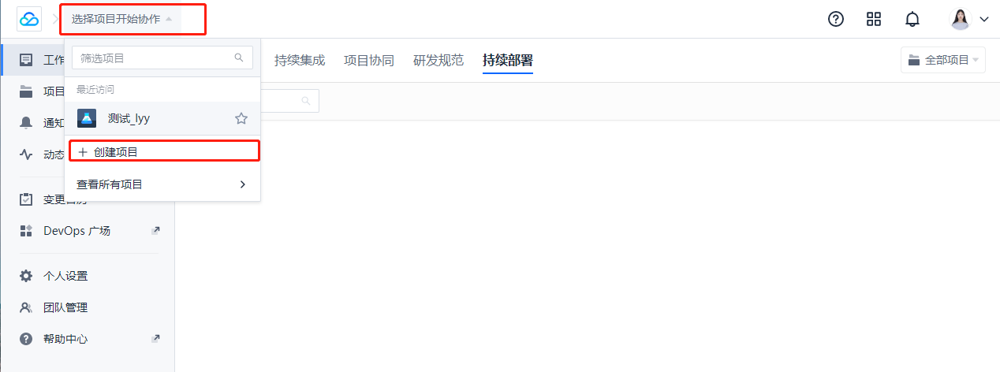
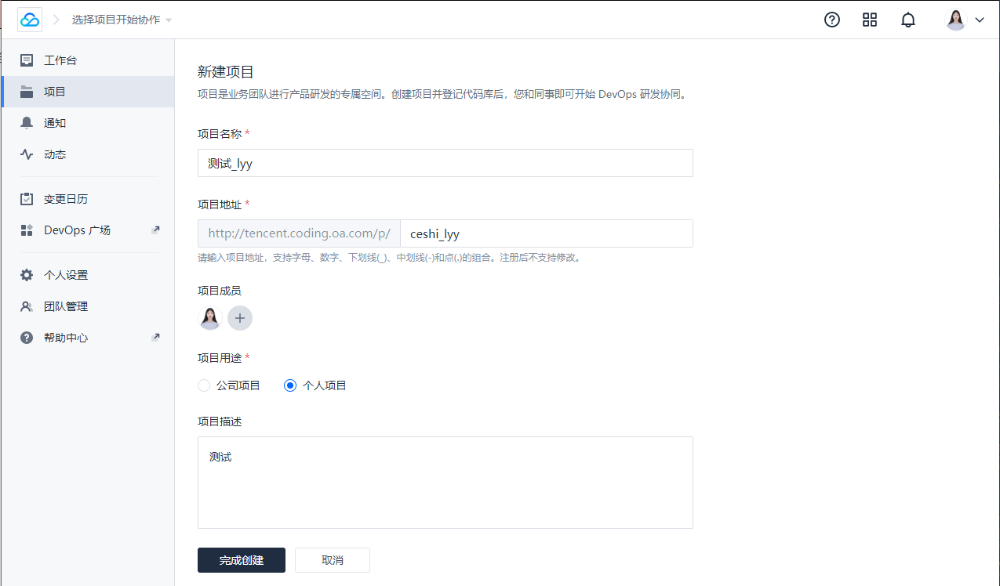
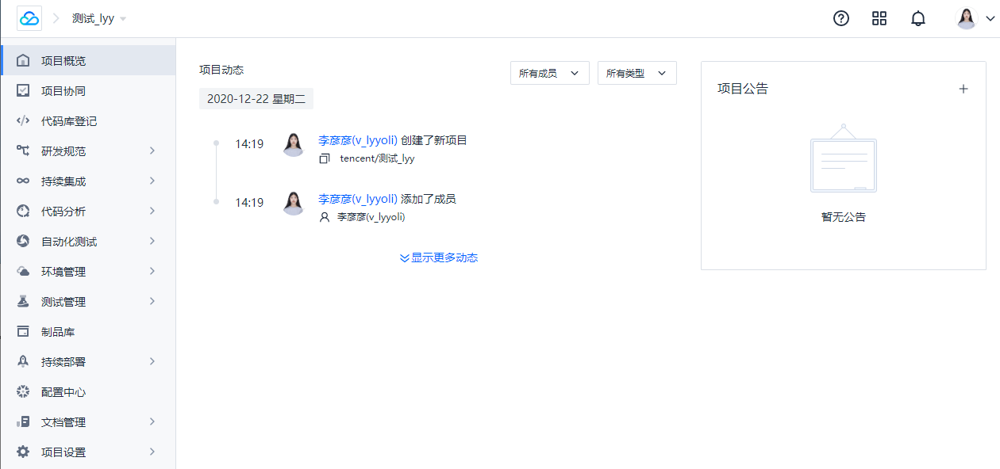

# 新建项目

访问[http://tencent.coding.oa.com](http://tencent.coding.oa.com/)

1.在工作台，点击【选择项目开始协作】按钮进入创建项目页面

2.完善项目信息

- 项目名称（必填）

- 项目英文名（必填，默认根据项目名称拼音生成，用于组成项目访问地址）

- 项目描述

  

3.点击【完成创建】按钮，创建成功后自动自动进入项目页面内

