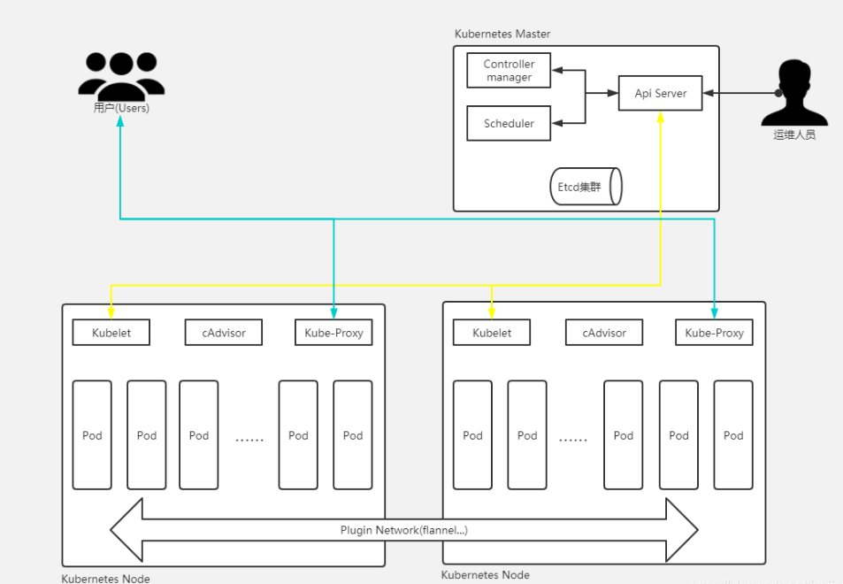

# Docker容器化封装应用程序的优缺点

## 优点

+ Docker引擎统一了基础设施环境 -- docker环境
  - 硬件的配置
  - 操作系统的版本
  - 运行时环境的异构
+ Docker引擎统一了程序打包（装箱）方式 -- docker镜像
  - java程序
  - python程序
  - nodejs程序
  - go程序
  - ...
+ Docker引擎统一了程序部署（运行）方式 -- docker容器
  - java - jar ...  --> docker run...
  - python manage.py runserver ...  --> docker run...
  - npm run dev --> docker run...

## 缺点

+ 单机使用，无法有效集群（单点）
+ 随着容器数量的上升，管理成本攀升
+ 没有有效的容灾/自愈机制
+ 没有预设编排模板，无法实现快速、大规模容器调度
+ 没有统一的配置管理中心工具
+ 没有容器生命周期的管理工具（管理容器状态【running、stop】的切换）
+ 没有图形化运维管理工具
+ ...

> 因此我们需要一套容器编排的工具
>
> 基于Docker容器引擎的开源容器编排工具目前市场上主要有：
>
> + docker compose、docker swarm
> + Mesosphere+Marathon
> + Kubernetes（K8S）

# 第一章：Kubernetes概述

+ 官网：https://kubernetes.io/
+ GitHub：https://github.com/kubernetes/kubernetes
+ 由来：谷歌的Borg系统，后经Go语言重写并捐献给CNCF基金会开源
+ 含义：源于希腊语，意为“舵手”或“飞行员”，k8s -->K12345678S
+ 重要作用：开源的容器编排框架工具（生态极其丰富）
+ 学习的意义：解决跑裸docker的若干痛点

> k8s是谷歌在2014年开业的容器化集群管理系统
>
> 使用k8s进行容器化应用部署
>
> 使用k8s利于应用扩展
>
> k8s目标实施让部署容器化应用更加简洁和高效

## Kubernetes优势

**1）自动装箱，水平扩展，自我修复**

**2）服务发现和负载均衡（流量调度）**

**3）自动发布（默认滚动发布模式）和回滚**

**4）集中化配置管理和密钥管理**

在不需要重新构建镜像的情况下，可以部署和更新密钥的应用配置，类似热部署

**5）存储编排**

自动实现存储系统挂载及应用，特别对有状态应用实现数据持久化非常重要，存储系统可以来自于本地目录、网络存储（NFS、Cluster、Ceph等）、公有云存储服务

**6）任务批处理运行**

定时任务

## Kubernetes特点

+ 轻量级：消耗的资源小
+ 开源
+ 弹性伸缩
+ 负载均衡：IPVS

## 基本概念

### Pod/Pod控制器

**pod**

```shell
#pod是K8S里能够被运行的最小逻辑单元（原子单元）
#1个Pod里面可以运行多个容器，他们共享UTS+NET+IPC名称空间
#共享网络
#生命周期是短暂的
#可以把Pod理解成豌豆荚，而同一个Pod内的每个容器是一颗颗豌豆
#一个Pod里运行多个容器，又叫：边车（SideCar）模式
pause是pod的根容器，pod中所有的container共享pod的网络栈和挂载存储
```

**Pod控制器**（controller）

```shell
确保预期的pod副本数量
有状态应用部署（有状态：依赖存储，网络ip唯一）
无状态应用部署
确保所有的node运行同一个pod
一次性任务和定时任务
#Pod控制器是Pod启动的一种模板，用来保证在K8S里启动的Pod应始终按照人们的预期运行（副本数、生命周期、健康状态检查...）

#K8S内提供了众多的Pod控制器，常用的有以下几种：
  ==Deployment==
  虽然ReplicaSet可以独立使用，但一般还是建议使用Deployment来自动管理ReplicaSet，这样就无需担心跟其他机制的不兼容问题（比如ReplicaSet不支持rolling-update回滚更新，但Deployment支持）
  ==DaemonSet==
  #ReplicaSet
  用来确保容器应用的副本数始终保持在用户定义的副本数，即如果有容器异常退出，会自动创建新的Pod来替代，；而如果异常多出来的容器也会自动回收；支持集合式的selector
  #StatefulSet（管理有状态应用的pod控制器）
  #Job（管理任务）
  #Cronjob（管理定期周期任务）
```

### Name/Namespace

**Name**

```shell
#由于K8S内部，使用“资源”来定义每一种逻辑概念（功能）故每种“资源”，都应该有自己的“名称”

#“资源”有api版本（APIVersion）、类别（kind）、元数据（metadata）、定义清单（spec）、状态（status）等配置信息

#“名称”通常定义在“资源”的“元数据”信息里
```

**Namespace**（对控制器分类）

```shell
#随着项目增多、人员增加、集群规模的扩大，需要一种能够隔离K8S内各种“资源”的方法，这就是名称空间
#名称空间可以理解为K8S内部的虚拟机群组
#不同名称空间内的“资源”，名称可以相同，相同名称空间内的同种“资源”，“名称”不能相同
#合理的使用K8S的名称空间，是的集群管理员能后更好的对交付到K8S里的任务进行分类管理和浏览
#K8S里默认存在的名称空间有：default、kube-system、kube-public
#查询K8S里特定“资源”要带上相应的名称空间
```

### Label/Label选择器

**Label**（对pod分类）

```shell
#标签是k8s特色的管理方式，便于分类管理资源对象
#一个标签可以对应多个资源，一个资源也可以有多个标签，他们是多对多的关系
#一个资源拥有多个标签，可以实现不同维度的管理
#标签的组成：key=value
#与标签类似的，还有一种“注解” （annotations）
```

**Label选择器**

```shell
#给资源打上标签后，可以使用标签选择器过滤指定的标签
#标签选择器目前有两个：基于等值（数值）关系（等于、不等于）和基于集合（逻辑）关系（属于、不属于、存在）
#许多资源支持内嵌标签选择器字段
  matchLabels
  matchExpressions
```

### Service/Ingress

**Server**

```shell
定义一组pod的访问规则
#在K8S的世界里，虽然每个Pod都会被分配一个单独的IP地址，但这个IP地址会随着Pod的销毁而消失
#Service（服务）就是用来解决这个问题的核心概念
#一个Service可以看做一组提供相同服务的Pod的对外访问接口
#Service作用于哪些Pod是通过标签选择器来定义的
```

**Ingress**

```shell
#Ingress是K8S集群里工作载OSI网络参考模型下，第7层的应用，对外暴露的接口
#Service只能进行L4流量调度，表现形式是ip+port
#Ingress则可以调度不同业务领域、不同URL访问路径的业务流量
```

## 核心组件



### 1、**主控（master）节点**【管理】

#### kube-apiserver服务（整个集群的大脑）

```shell
集群统一入口，以restful方式，交给etcd存储
#提供了集群管理的REST API接口（包括鉴权、数据校验及集群状态变更）
#负责其他模块之间的数据交互，承担通信枢纽功能
#是资源配额控制的口
#提供完备的集群安全机制
```

#### kube-controller-manager服务

```shell
处理集群中常规后台任务，一个资源对应一个控制器
维持副本的期望数目
#有一系列控制器组成，通过apiserver监控整个集群的状态，并确保集群处于预期的工作状态
#Node Controller
#Deployment Controller
#Service Controller
#Volume Controller
#Endpoint Controller
#Garbage Controller
#Namespace Controller
#Job Controller
#Resource quta Controller
...
```

#### kube-scheduler服务

```shell
节点调度，选择node节点应用部署
#主要功能是接收调度pod到适合的运算节点上
#预算策略（predict）
#优选策略（priorities）
```

#### **配置存储中心-->etcd服务**（数据库）


```shell
#存储系统，用于保存集群相关的数据
etcd的官方将它定位成一个可信赖的分布式键值存储服务，它能够为整个分布式集群存储一些关键数据，协助分布式集群的正常运转
https://www.cnblogs.com/panpanwelcome/p/8242418.html
# HTTP Server
用于处理用户发送的API请求以及其它etcd节点的同步与心跳信息请求
# Raft 
Raft是一种更为简单方便易于理解的分布式算法，主要解决了分布式中的一致性问题，比如增加了强领导性，优化了领导的选举过程，在成员发生变化之后依然能够很好的进行工作。
# WAL 预写式日志
是etcd的数据存储方式。除了在内存中存有所有数据的状态以及节点的索引以外，etcd就通过WAL进行持久化存储。WAL中，所有的数据提交前都会事先记录日志
# Entry
Entry表示存储的具体日志内容。
# Snapshot
etcd防止WAL文件过多而设置的快照，存储etcd数据状态
# Store
Store：用于处理etcd支持的各类功能的事务，包括数据索引、节点状态变更、监控与反馈、事件处理与执行等等，是etcd对用户提供的大多数API功能的具体实现
```

### 2、**运算（node）节点**

#### kube-kubelet服务

```shell
master派到node节点代表，管理本机容器
直接跟容器引擎交互实现容器的生命周期管理
#简单地说，kubelet的主要功能就是定时从某个地方获取节点上pod的期望状态（运行什么容器、运行的副本数量、网络或者存储如何配置等等），并调用对应的容器平台接口达到这个状态
#定时会报当前节点的状态给apiserver，以供调度的时候使用
#镜像和容器的清理工作，保证节点上镜像不会沾满磁盘空间，退出的容器不会占用太多资源
```

#### kube-proxy服务

```shell
提供网络代理，负载均衡等操作
负责写入规则至IPTABLES、IPVS实现服务映射访问
#是K8S在每个节点上运行网络代理，service资源的载体
#建立了pod网络和集群网络的关系（clusterip——>podip）
#常用三种流量调度模式
  - Userspace（废弃）
  - Iptables（濒临废弃）
  - Ipvs（推荐）

#负责建立和删除包括更新调度规则、通知apiserver自己的更新，或者从apiserver那里获取其他kube-proxy的调度规则变化来更新自己的
```

### 3、CLI客户端

```shell
#kubectl(命令行)
```

### 4、核心附件

```shell
#CNI网络插件-->flannel/calico
#服务发现用插件-->coredns  可以为集群中的service创建一个域名IP的对应关系解析
#服务暴露用插件-->traefik
#GUI管理插件-->Dashboard    给k8s集群提供一个B/S结构访问体系
#INGRESS CONTROLLER  官方只能实现四层代理，INGRESS可以实现七层代理
#FEDERATION 提供一个可以跨集群中心多个k8s统一管理功能
#PRIMETHEUS 提供k8s集群的监控能力
#ELK 提供k8s集群日志统一分析接入平台
```

## Kubernetes网络图


## Kubernetes逻辑架构图


https://blog.csdn.net/fanjianhai

# 第二章：部署K8S集群


## 常见的K8S安装部署方式：

**Minikube 单节点微型K8S（仅供学习、预览使用）**

官方文档：https://kubernetes.io/docs/tutorials/hello-minikube/


**二进制安装部署（生产首选，新手推荐）**

**使用kubeadmin进行部署，K8S的部署工具，跑在K8S里（相对简单，熟手推荐）**

## kubeadm部署方式

### 1、安装要求

| IP        | Hostname | CPU核数 | 内存 | 硬盘 | 说明     |
| --------- | -------- | ------- | ---- | ---- | -------- |
| 10.0.0.48 | master   | 2       | 4G   | 50G  | 控制节点 |
| 10.0.0.47 | node     | 2       | 4G   | 50G  | 执行节点 |

```shell
#操作系统
[root@VM-0-48-centos ~]# cat /etc/redhat-release 
CentOS Linux release 7.2 (Final)
#集群机器间可以互通
#可以访问外网，需要下载镜像
```

### 2、准备环境

关闭防火墙

```shell
#查看防火墙状态
[root@VM-0-48-centos ~]# firewall-cmd --state
not running
```

关闭selinux

```shell
#所有节点执行
setenforce 0  #临时
sed -i 's/^SELINUX=.*/SELINUX=disabled/' /etc/selinux/config    #永久
```

禁用swap

```shell
swap仅当在内存不足时使用硬盘空间充当额外内存，因为硬盘IO速度和内存差距较大，禁用swap可以提升性能
# 所有节点服务器执行
swapoff -a
sed -i 's/.*swap.*/#&/' /etc/fstab
```

设置主机名

```shell
[root@VM-0-48-centos ~]# hostnamectl set-hostname master
[root@VM-0-47-centos ~]# hostnamectl set-hostname node
#退出再重新登录
```

在master添加hosts

```shell
cat >> /etc/hosts <<EOF
10.0.0.48 master
10.0.0.47 node
EOF
```

将桥接的ipv4流量传递到iptables的链

```shell
#所有机器执行
[root@master ~]# cat > /etc/sysctl.d/k8s.conf <<EOF
> net.bridge.bridge-nf-call-ip6tables = 1
> net.bridge.bridge-nf-call-iptables = 1
> EOF
 #生效
[root@master ~]# sysctl --system 
```

时间同步

```shell
#所有机器执行
[root@master ~]# yum -y install ntpdate
[root@master ~]# ntpdate time.windows.com
```

### 3、安装docker/kubeadm/kubelet/kubectl

安装docker

```shell
#1.安装必要的依赖
yum install -y yum-utils device-mapper-persistent-data lvm2
#2.添加aliyum docker-ce yum源
yum-config-manager --add-repo http://mirrors.aliyun.com/docker-ce/linux/centos/docker-ce.repo
#3.重建yum缓存
yum makecache
#4.查看可用的docker版本
yum list docker-ce.x86_64 --showduplicates | sort -r
#5.安装docker
yum -y install docker-ce-18.06.1.ce-3.el7
#6.配置docker的镜像源
cat >> /etc/docker/daemon.json << EOF
{
  "registry-mirrors": ["https://b9pmyelo.mirror.aliyuncs.com"]
}
EOF
#7.启动
systemctl start docker
#8.查看是否安装成功
docker --version
#9.添加阿里云yum软件源
cat > /etc/yum.repos.d/kubernetes.repo <<EOF
[kubernetes]
name=Kubernetes
baseurl=https://mirrors.aliyun.com/kubernetes/yum/repos/kubernetes-el7-x86_64/
enabled=1
gpgcheck=1
repo_gpgcheck=1
gpgkey=https://mirrors.aliyun.com/kubernetes/yum/doc/yum-key.gpg https://mirrors.aliyun.com/kubernetes/yum/doc/rpm-package-key.gpg
EOF
# 重建yum缓存，输入y添加证书认证
yum makecache
```

安装kubeadm、kubelet和kubectl

```shell
#安装
yum install -y kubelet-1.18.0 kubeadm-1.18.0 kubectl-1.18.0
#启动
[root@master ~]# systemctl start kubelet
```

### 4、部署Kubernetes Master【master】

在10.0.0.48master节点执行

```shell
#初始化
kubeadm init --apiserver-advertise-address=10.0.0.48 --image-repository registry.aliyuncs.com/google_containers --kubernetes-version v1.18.0 --service-cidr=10.96.0.0/12  --pod-network-cidr=10.244.0.0/16


--apiserver-advertise-address=10.0.0.48 /    #本地ip
--image-repository registry.aliyuncs.com/google_containers /  #阿里云镜像
--kubernetes-version v1.18.0 /   #版本
--service-cidr=10.96.0.0/12 /	#网络
--pod-network-cidr=10.244.0.0/16
#当出现下面的情况表示Kubernetes镜像已经安装成功
```


根据提示执行

```shell
mkdir -p $HOME/.kube
  sudo cp -i /etc/kubernetes/admin.conf $HOME/.kube/config
  sudo chown $(id -u):$(id -g) $HOME/.kube/config
 
#查看，目前只有master一个节点
[root@master ~]# kubectl get nodes
```


下面我们还需要在Node节点执行其它的命令，将node1加入到我们的master节点上

### 5、 加入Kubernetes Node【Slave节点】

我们需要到 node1 服务器，执行下面的代码向集群添加新节点

执行在kubeadm init输出的kubeadm join命令：

> 注意，以下命令是在master初始化完成后，每个人的都不一样，需要复制自己生成的

```shell
#记得在node节点执行
kubeadm join 10.0.0.48:6443 --token 7qwnut.eylud0kpvpgknfw4 /
    --discovery-token-ca-cert-hash sha256:a5d7986def22eb41466aa7b9a0fef7df13adfd770b9e60d6990a19dcd284e62c
```

通过kubectl命令查看集群状态,显示已经有了node节点，但是状态是NotReady（由于缺少网络组件）

```shell
[root@master ~]# kubectl get nodes
```


### 6、部署CNI网络插件

上面的状态还是NotReady，下面我们需要网络插件，来进行联网访问

```shell
# 下载网络插件配置
wget https://raw.githubusercontent.com/coreos/flannel/master/Documentation/kube-flannel.yml
```

默认镜像地址无法访问，sed命令修改为docker hub镜像仓库。

```shell
# 添加
kubectl apply -f https://raw.githubusercontent.com/coreos/flannel/master/Documentation/kube-flannel.yml
# 注意：这里wget有可能会显示Unable to establish SSL connection的错误，有些网站不允许通过非浏览器的方式进行下载，可以直接通过浏览器下载，然后上传至服务器


# 查看状态 【kube-system是k8s中的最小单元】
kubectl get pods -n kube-system
```


现在查看node状态，Ready


### 7、测试Kubernetes集群

k8s是容器化技术，可以联网去下载镜像，用容器的方式进行启动

在Kubernetes集群中创建一个pod，验证是否正常运行

```shell
#下载nginx【联网拉取nginx镜像】
[root@master ~]# kubectl create deployment nginx --image=nginx
#查看状态，running
[root@master ~]# kubectl get pod
```


下面我们就需要将端口暴露出去，让其能够被外界访问

```shell
#对外暴露80端口
[root@master ~]# kubectl expose deployment nginx --port=80 --type=NodePort
#查看端口
[root@master ~]# kubectl get pod,svc
```


浏览器访问Node：port   成功访问到nginx欢迎页

http://159.75.8.52:31505/


到此为止，我们就搭建了一个单master的k8s集群


## 二进制部署方式

> 参考https://jimmysong.io/kubernetes-handbook/practice/etcd-cluster-installation.html

### 1、安装要求

| IP        | Hostname | CPU核数 | 内存 | 硬盘 | 说明     |
| --------- | -------- | ------- | ---- | ---- | -------- |
| 10.0.0.48 | master   | 2       | 4G   | 50G  | 控制节点 |
| 10.0.0.47 | node     | 2       | 4G   | 50G  | 执行节点 |

+ 操作系统

```shell
[root@VM-0-48-centos ~]# cat /etc/redhat-release 
CentOS Linux release 7.2 (Final)
```

+ 集群机器间可以互通
+ 可以访问外网，需要下载镜像
+ 禁止swap分区

### 2、操作系统初始化

关闭防火墙

```shell
#所有节点都执行
[root@master ~]# systemctl stop firewalld
```

关闭selinux

```shell
#所有节点执行
[root@master ~]# setenforce 0   #临时
sed -i 's/^SELINUX=.*/SELINUX=disabled/' /etc/selinux/config
```

关闭swap

```shell
#所有节点执行
[root@node ~]# swapoff -a
```

设置主机名

```shell
[root@master ~]# hostnamectl set-hostname master
```

master节点添加hosts

```shell
cat >> /etc/hosts <<EOF
10.0.0.48 master
10.0.0.47 node
EOF
```

将桥接的ipv4流量传递到iptables的链

```shell
#所有机器执行
[root@master ~]# cat > /etc/sysctl.d/k8s.conf <<EOF
> net.bridge.bridge-nf-call-ip6tables = 1
> net.bridge.bridge-nf-call-iptables = 1
> EOF
 #生效
[root@master ~]# sysctl --system 
```

时间同步

```shell
#所有机器执行
[root@master ~]# yum -y install ntpdate
#与本地windows时间同步
[root@master ~]# ntpdate time.windows.com
```

### 3、为etcd和apiserver自签证书

提到证书，我们想到的就是下面这种情况


这个https证书，其实就是服务器颁发给网站的，代表这是一个安全可信任的网站。

而在我们K8S集群的内部，其实也是有证书的，如果不带证书，那么访问就会受限

同时在集群内部 和 外部的访问，我们也需要签发证书

**证书**


如果我们使用二进制的方式，那么就需要自己手动签发证书。

**自签证书**

自签证书：我们可以想象成在一家公司上班，然后会颁发一个门禁卡，同时一般门禁卡有两种，一个是内部员工的门禁卡，和外部访客门禁卡。这两种门禁卡的权限可能不同，员工的门禁卡可以进入公司的任何地方，而访客的门禁卡是受限的，这个门禁卡其实就是自签证书


#### 1）创建配置文件

> CA 配置文件用于配置根证书的使用场景 (profile) 和具体参数 (usage，过期时间、服务端认证、客户端认证、加密等)，后续在签名其它证书时需要指定特定场景。

```shell
mkdir -p k8s/{k8s-cert,etcd-cert}
cd k8s/etcd-cert/

#cat > ca-config.json <<EOF
{
  "signing": {
    "default": {
      "expiry": "87600h"
    },
    "profiles": {
      "www": {
         "expiry": "87600h",
         "usages": [
            "signing",
            "key encipherment",
            "server auth",
            "client auth"
        ]
      }
    }
  }
}
EOF

#注意
#1.signing ：表示该证书可用于签名其它证书，生成的 ca.pem 证书中CA=TRUE ；
#2.server auth ：表示 client 可以用该该证书对 server 提供的证书进行验证；
#3.client auth ：表示 server 可以用该该证书对 client 提供的证书进行验证；
```

#### 2）**创建证书签名请求文件**

```shell
#cat > ca-csr.json <<EOF
{
    "CN": "etcd CA",
    "key": {
        "algo": "rsa",
        "size": 2048
    },
    "names": [
        {
            "C": "CN",
            "L": "Beijing",
            "ST": "Beijing"
        }
    ]
}
EOF

#注意：
#CN：Common Name ，kube-apiserver 从证书中提取该字段作为请求的用户名(User Name)，浏览器使用该字段验证网站是否合法；
```

#### 3）生成CA证书和密钥

```shell
[root@master ~/k8s/etcd-cert]# cfssl gencert -initca ca-csr.json | cfssljson -bare ca
#查看
[root@master ~/k8s/etcd-cert]# ls
ca-config.json  ca.csr  ca-csr.json  ca-key.pem  ca.pem
```

#### 4）创建json文件

```shell
#cat > server-csr.json <<EOF
{
    "CN": "etcd",
    "hosts": [
    "10.0.0.48",
    "10.0.0.47"
    ],
    "key": {
        "algo": "rsa",
        "size": 2048
    },
    "names": [
        {
            "C": "CN",
            "L": "BeiJing",
            "ST": "BeiJing"
        }
    ]
}
EOF
```

#### 5)生成证书文件

```shell
[root@master ~/k8s/etcd-cert]# cfssl gencert -ca=ca.pem -ca-key=ca-key.pem -config=ca-config.json -profile=www server-csr.json | cfssljson -bare server


[root@master ~/k8s/etcd-cert]# cfssl gencert -ca=ca.pem -ca-key=ca-key.pem -config=ca-config.json -profile=www server-csr.json | cfssljson -bare server
cfssljson : command not found
#注意：如果在生成证书文件过程中没有cfss命令时候，需要通过下载安装

curl -L https://pkg.cfssl.org/R1.2/cfssl_linux-amd64 -o /usr/local/bin/cfssl
curl -L https://pkg.cfssl.org/R1.2/cfssljson_linux-amd64 -o /usr/local/bin/cfssljson
curl -L https://pkg.cfssl.org/R1.2/cfssl-certinfo_linux-amd64 -o /usr/local/bin/cfssl-certinfo
chmod +x /usr/local/bin/cfssl /usr/local/bin/cfssljson /usr/local/bin/cfssl-certinfo
```

显示生成成功


查看server开头的都是证书文件

```shell
[root@master ~/k8s/etcd-cert]# ls
```


最终生成证书的文件


### 4、部署etcd集群

> 从Github或者GOOGLE下载二进制文件
>
> 官方文档：https://github.com/etcd-io/etcd/releases/
>
> 无法下载可以先通过浏览器下载然后上传至服务器
>
> https://storage.googleapis.com/etcd/v3.4.9/etcd-v3.4.9-linux-amd64.tar.gz

```shell
#解压并进入目录下
[root@master ~/etcd-v3.4.9-linux-amd64]# tar zxvf etcd-v3.4.9-linux-amd64.tar.gz
#查看
[root@master ~]# cd etcd-v3.4.9-linux-amd64
```


由于etcd相关配置文件默认在/opt/etcd 下

```shell
[root@master ~/etcd-v3.4.9-linux-amd64]# mkdir /opt/etcd/{cfg,bin,ssl} -p

#将etcd下解压之后的etcd和etcdctl两个启动文件拷贝到bin目录下
[root@master ~/etcd-v3.4.9-linux-amd64]# mv ./{etcd,etcdctl} /opt/etcd/bin/
#并将etcd证书植入到etcd目录
[root@master ~/etcd-v3.4.9-linux-amd64]# cp /root/k8s/etcd-cert/{ca*pem,server*pem} /opt/etcd/ssl/
```

创建etcd.conf

```shell
[root@master /opt/etcd/cfg]# vim /opt/etcd/cfg/etcd.conf
#[Member]
ETCD_NAME="etcd-1"
ETCD_DATA_DIR="/var/lib/etcd/default.etcd"
ETCD_LISTEN_PEER_URLS="https://10.0.0.48:2380"
ETCD_LISTEN_CLIENT_URLS="https://10.0.0.48:2379"

#[Clustering]
ETCD_INITIAL_ADVERTISE_PEER_URLS="https://10.0.0.48:2380"
ETCD_ADVERTISE_CLIENT_URLS="https://10.0.0.48:2379"
ETCD_INITIAL_CLUSTER="etcd-1=https://10.0.0.48:2380,etcd-2=https://10.0.0.47:2380"
ETCD_INITIAL_CLUSTER_TOKEN="etcd-cluster"
ETCD_INITIAL_CLUSTER_STATE="new"


ETCD_NAME 节点名称
ETCD_DATA_DIR 数据目录
ETCD_LISTEN_PEER_URLS 集群通信监听地址
ETCD_LISTEN_CLIENT_URLS 客户端访问监听地址
ETCD_INITIAL_ADVERTISE_PEER_URLS 集群通告地址
ETCD_ADVERTISE_CLIENT_URLS 客户端通告地址
ETCD_INITIAL_CLUSTER 集群节点地址
ETCD_INITIAL_CLUSTER_TOKEN 集群Token
ETCD_INITIAL_CLUSTER_STATE 加入集群的当前状态，new是新集群，existing表示加入已有集群

```

添加systemd

```shell
#配置etcd服务由systemd管理
[root@master /opt/etcd]# vim /usr/lib/systemd/system/etcd.service
[Unit]
Description=Etcd Server
After=network.target
After=network-online.target
Wants=network-online.target

[Service]
Type=notify
EnvironmentFile=/opt/etcd/cfg/etcd
ExecStart=/opt/etcd/bin/etcd /
--name=${ETCD_NAME} /
--data-dir=${ETCD_DATA_DIR} /
--listen-peer-urls=${ETCD_LISTEN_PEER_URLS} /
--listen-client-urls=${ETCD_LISTEN_CLIENT_URLS},http://127.0.0.1:2379 /
--advertise-client-urls=${ETCD_ADVERTISE_CLIENT_URLS} /
--initial-advertise-peer-urls=${ETCD_INITIAL_ADVERTISE_PEER_URLS} /
--initial-cluster=${ETCD_INITIAL_CLUSTER} /
--initial-cluster-token=${ETCD_INITIAL_CLUSTER_TOKEN} /
--initial-cluster-state=new /
--cert-file=/opt/etcd/ssl/server.pem /
--key-file=/opt/etcd/ssl/server-key.pem /
--peer-cert-file=/opt/etcd/ssl/server.pem /
--peer-key-file=/opt/etcd/ssl/server-key.pem /
--trusted-ca-file=/opt/etcd/ssl/ca.pem /
--peer-trusted-ca-file=/opt/etcd/ssl/ca.pem
Restart=on-failure
LimitNOFILE=65536

[Install]
WantedBy=multi-user.target
```

目前已经配置完毕，配置完毕第一个etcd节点之后，启动一个节点的话，是无法正常启动的，需要保证node节点etcd服务处理监听状态

```shell
#将第一个etcd节点的etcd配置文件/证书文件/二进制启动文件/systemd管理的etcd启动文件拷贝到其它节点上去（ps:拷贝到其它节点之后，注意修改etcd配置文件中对应的IP信息）

[root@master ~]# scp -r /opt/etcd/ root@10.0.0.47:/opt/
[root@master ~]# scp -r /usr/lib/systemd/system/etcd.service root@10.0.0.47:/usr/lib/systemd/system/etcd.service

#修改/opt/etcd/cfg/etcd.conf
#[Member]
ETCD_NAME="etcd-2"
ETCD_DATA_DIR="/var/lib/etcd/default.etcd"
ETCD_LISTEN_PEER_URLS="https://10.0.0.47:2380"
ETCD_LISTEN_CLIENT_URLS="https://10.0.0.47:2379"

#[Clustering]
ETCD_INITIAL_ADVERTISE_PEER_URLS="https://10.0.0.47:2380"
ETCD_ADVERTISE_CLIENT_URLS="https://10.0.0.47:2379"
ETCD_INITIAL_CLUSTER="etcd-1=https://10.0.0.48:2380,etcd-2=https://10.0.0.47:2380"
ETCD_INITIAL_CLUSTER_TOKEN="etcd-cluster"
ETCD_INITIAL_CLUSTER_STATE="new"

[root@master ~]# ln -s /opt/etcd/bin/etcdctl  /usr/bin/
[root@master ~]# ln -s /opt/etcd/bin/etcd  /usr/bin/
```

启动etcd

```shell
[root@master ~]# systemctl daemon-reload
[root@master ~]# systemctl start etcd

#注意：
这里启动报错找不到原因，可以使用etcd来启动，尽量使用systemd来启动方便于后续的管理
#不清楚可以参考https://www.cnblogs.com/along21/p/10044931.html
[root@master ~]# etcd
```

查看是否启动（对应端口2379 2380）


### 5、部署master组件

#### 1）为apiserver自签证书

+ 添加可信任ip列表
+ 携带ca证书发送
+ 

### 6、部署node组件

### 7、部署集群网络


互联网三大技术飞跃

c/s(服务器客户端系统)-->b/s（浏览器即可）

移动互联网飞跃（app）

小程序（微信小程序，统一了平台）

