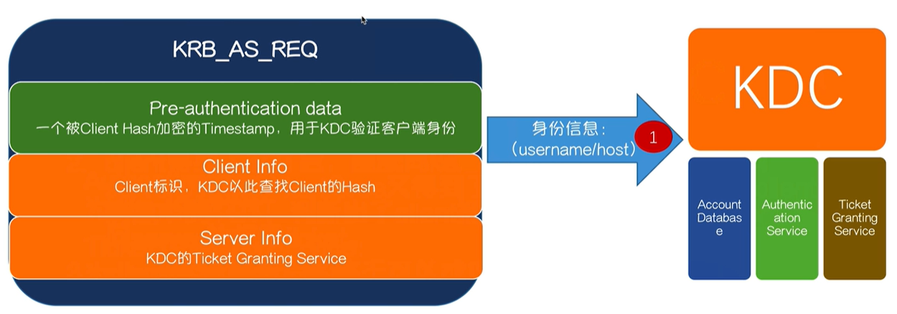

# Windows认证

## Windows本地认证

账号密码


> 我的密码在哪里

路径：
%SystemRoot%\system32\confing\sam

当我们登录系统的时候，系统会自动地读取SAM文件中的“密码”与我们输入的“密码”进行比对，如果相同，证明认证成功

`所以SAM文件千万不要被别人拿走`


### NTLM（NT LAN Manager） Hash

+ NTLM Hash 是支持Net NTLM认证协议及本地认证过程中的一个重要参与物，其长度为32位，由数字与字母组成
+ Windows本身不存储用户的明文密码，它会将用户的明文密码经过加密算法后存储在SAM数据库中
+ 当用户登录时，将用户输入的明文密码也加密成NTLM Hash，与SAM数据库中的NTLM Hash进行比较。NTLM Hash的前身是LM Hash，目前基本淘汰，但是还是存在。

> NTLM Hash ——产生

admin => 209c6174da490caeb422f3fa5a7ae634  (32位)


```sql
admin -> hex(16进制编码) = 61646d696e

61646d696e -> Unicode = 610064006d0069006e00

610064006d0069006e00 -> MD4= 209c6174da490caeb422f3fa5a7ae634

admin => 209c6174da490caeb422f3fa5a7ae634
```

## 本地认证流程

+ Windows Logon Process(即winlogon.exe)，是Windows NT用户登陆程序，用于管理用户登录和退出。

+ LSASS用于微软Windows系统的安全机制。它用于本地安全和登陆策略。

  

## Windows 网络认证

+ 在内网渗透中，经常遇到工作组环境，而工作组环境是一个逻辑上的网络环境（工作区），隶属于工作组的机器之间无法互相建立一个完美的信任机制，只能点对点，是比较落后的认证方式，没有信托机构。

+ 假设A主机与B主机属于同一个工作组环境，A想访问B主机上的资料，需要将一个存在于B主机上的账户凭证发送至B主机，经过认证才能够访问B主机上的资源。

+ 最常见的服务:SMB服务端口:445

### NTLM（NT LAN Manger）协议

+ 早期SMB协议在网络上传输明文口令。后来出现LAN ManagerChallenge/Response 验证机制，简称LM，它是如此简单以至很容易就被破解。
+ 微软提出了WindowsNT挑战/响应验证机制，称之为NTLM。现在已经有了更新的NTLMv2以及Kerberos验证体系。
+ smb只提供了文件的创建、修改等操作，而认证还要依赖于NTLM协议

> 挑战（Challenge）/响应（Response）

+ 第一步协商：

  客户端主要在这一步向服务器确认协议的版本，是v1还是v2


+ 第二步质询

客户端向服务器端发送用户信息（用户名）请求

服务器接受到请求，生成一个16位的随机数，被称之为“Challenge",使用登录用户名对应的NTLM Hash加密Challenge (16位随机字符)﹐生成Challenge1。同时，生成Challenge1后，将Challenge (16位随机字符）发送给客户端。// Net NTLM Hash（Challenge1根据客户端提供的用户信息生成的） = NTLM Hash(Challenge)服务端随机生成的

客户端接受到Challenge后，使用将要登录到账户对应的NTLM Hash加密Challenge生成Response，然后将Response发送至服务器端。

服务器端收到客户端的Response后，比对Chanllenge1与Response是否相等，若相等，则认证通过。

+ 第三步验证

这一步其实就上面质询过程中的第四点


#### NTLM v2协议

NTLM v1与NTLM v2最显著的区别就是Challenge与加密算法不同，共同点就是加密的原料都是NTLM Hash。
下面细说一下有什么不同:

Challage: NTLM v1的Challenge有8位，NTLM v2的Challenge为16位。

Net-NTLM Hash: NTLM v1的主要加密算法是DES，NTLM v2的主要加密算法是HMAC-MD5。

lResponder 、smbexec

### Pass The Hash（哈希传递）

在内网渗透中，我们经常会抓取管理员的密码、NTLM Hash，通过搜集这些信息有助于我们扩大战果，尤其是在域环境下。

什么是哈希传递？

哈希传递是能够在不需要账户明文密码的情况下完成认证的一个技术

哈希传递的作用？

解决了我们渗透中获取不到明文密码、破解不了NTLM Hash而又想扩大战果的问题

>  Pass The Hash必要条件

哈希传递需要被认证的主机能够访问到服务器（废话）

哈希传递需要被传递认证的用户名

哈希传递需要被传递认证用户的NTLM Hash

##### 原理分析

要完成一个NTLM认证，第一步需要客户端将自己要参与认证的用户名发送至服务器端，等待服务器端给出的challenge...


其实哈希传递就是使用用户名对应的NTLM Hash将服务器给出的Chanllenge加密，生成一个Response，来完成认证

##### 工具

+ smbmap

  

+ CrackMapExec

+ Smbexec

+ Metasploit

## Active Directory（活动目录：域服务）概念

Active Directory存储了有关==网络对象==的信息，并且让管理员和用户能够轻松地查找和使用这些信息。Active Directory使用了一种结构化的数据存储方式，并以此作为基础对目录信息进行合乎==逻辑的分层组织==

网络对象分为：用户、用户组、计算机、域、组织单位以及安全策略等

## 功能

+ ==服务器及客户端计算机管理==：管理服务器及客户端计算机账户，所有服务器及客户端计算机加入域管理并实施组策略
+ ==用户服务==：管理用户域账户、用户信息、企业通讯录（与电子邮件系统集成）、用户组管理、用户身份认证、用户授权管理等，按省实施组管理策略
+ ==资源管理==：管理打印机、文件共享服务等网络资源
+ ==桌面配置==：系统管理员可以集中的配置各种桌面配置策略，如：用户使用域中资源权限限制、界面功能的限制、应用程序执行特征、网络连接限制、安全配置限制等
+ ==应用系统支撑==：支持财务、人事、电子邮件、企业信息门户、办公自动化、补丁管理、防病毒系统等各种应用系统

## 域认证体系——kerbroes

kerberos是一种网络认证协议，其设计目标是通过密钥系统为客户机/服务器应用程序提供强大的认证服务。该认证过程的实现不依赖于主机操作系统的认证，无需基于主机地址的信任，不要求网络上所有主机的物理安全，并假定网络上传送的数据包可以被任意地读取、修改和插入数据。在以上情况下，kerberos作为一种可信任的第三方认证服务，是通过传统的密码技术（如：共享密钥类似于对称加密算法）执行认证服务的

### 域认证所参与的角色（三只狗头）


+ Client

+ Server

+ KDC（Key Distribution Center）= DC   域控

  域认证所参与的角色

  - AD（account database）：存储所有client的白名单，只有存在于白名单的client才能顺利申请到TGT
  - Authentication Service（AS）：为client生成TGT的服务
  - Ticket Granting Service（TGS）：为client生成某个服务的ticket


PS：从物理层面看，AD与KDC均为域控制器（Domain Controller）

### 域认证流程

1. client向kerberos服务请求，希望获取访问server的权限，kerberos得到了这个消息，首先得判断client是否是可信赖的，也就是白名单黑名单的说法。这就是AS服务完成的工作，通过在AD中存储黑名单和白名单来区分client。成功后，返回AS返回TGT给client
2. client得到了TGT后，继续向kerberos请求，希望获取访问server的权限。kerberos又得到了这个消息，这时候通过client消息中的TGT，判断出了client拥有了这个权限，给了client访问server的权限ticket
3. client得到ticker后，终于可以成功访问server。这个ticket只是针对这个server，其他server需要向TGS申请

#### Session Key 与 Ticket Granting Ticket — 第一步





#### Session Key 与 Ticket 第二步


#### Server Session Key 与 Ticket — 第三步


## 白银票据（Silver Tickets）

白银票据特点：

+ 不需要与KDC进行交互
+ 需要目标服务的NTLM Hash（计算机名对应的hash）

在第三步认证中的Ticker的组成：

Ticket=Server Hash（Server Session Key+Client info+End Time）

当拥有Server Hash时，我们就可以伪造一个不经过KDC认证的一个Ticket

PS：Server Session Key在未发送Ticket之前，服务器是不知道Server Session Key是什么的

所以，一切凭据都来源于Server Hash

#### 白银票据 — 伪造

Mimikatz：

kerberos::list  #列出票据

kerberos::purge   #清除票据

1. 导出目标服务器的hash，计算机名对应的hash（Username：WIN-GCA3...）

Mimikatz: C:\files>mimikatz.exe "privilege::debug""sekurlsa::.logonpasswords" "exit" > log.txt


2. 伪造票据： mimikatz  “kerberos::golden /domain:<域名> /sid:<域SID> /target:<目标服务器主机名> .域名 /service:<服务类型> /rc4:<NTLM Hash> /user:<用户名> /ptt” exit
3. 

#### 白银票据 — 默认服务【服务类型】

由于白银票据需要目标服务器的Hash，所以没办法生成对应域内所有服务器的票据，也不能通过TGT申请。因此只能针对服务器上的某些服务去伪造，伪造的服务类型列表如下：


> 通过伪造白银票据获得Server文件共享的权限

#### 白银票据 — 防御

1. 尽量保证服务器凭证不被窃取
2. 开启PAC（Privileged Attribute Certificate）特权属性证书保护功能，PAC主要是规定服务器将票据发送给kerberos服务，由kerberos服务验证票据是否有效

开启方式：将注册表中HKEY_LOCAL_MACHINE\SYSTEM\ValidataKdcPacSignature设置为1

## 黄金票据（Golden Tickets）

黄金票据特点：

+ 需要与DC通信
+ 需要krbtgt用户的hash

这里的krbtgt hash就是之前讲的KDC Hash


黄金票据（Golden Tickets） — MSF kiwi


创建黄金票据


```sql
golden_ticket_create -d 域名 -k krgtbt的hash -s 域的SID -u 任意用户名 -t 保存路径
```

导入黄金票据


创建进程

调用wmic


#### 黄金票据 — 伪造

伪造票据：mimikatz "kerberos::golden /domain:<域名>/sid:<域SID>/rc4:<KRBTGT NTLM Hash> /user:<任意用户名> /ptt" exit

## Tickets总结

+ 黄金票据：从攻击面来看，获取krbtgt用户的hash后，可以在域中进行持久性的隐藏，并且日志无法溯源，但是需要拿到DC权限，使用黄金票据能够在一个域环境中长时间控制整个域
+ 从防御角度来看，需要经常更新krbtgt的密码，才能够使得原有的票据失效。最根本的办法是不允许域管账户登录其他服务器
+ 白银票据：从攻击面来看，伪造白银票据的难度比伪造黄金票据的难度较小，因为一个域中的服务器如果对外的话，非常容易被入侵，并且容易被转储Server Hash
+ 从防御角度来看，需要开启PAC认证，但这会降低认证效率，增加DC的负担，最根本的还是要加固服务器本身对外的服务

## Windows Access Token 简介

Windows Token其实叫Access Token（访问令牌），它是一个描述进程或者线程安全上下文的一个对象。不同的用户登录计算机后，都会生成一个Access Token，这个Token在用户创建进程或者线程时会被使用，不断的拷贝，这也就解释了A用户创建一个进程而该进程没有B用户的权限

种类：Access Token分为两种（主令牌、模拟令牌）

一般情况下，用户双击运行一个程序，都会拷贝“explorer.exe”的Access Token

当用户注销后，系统将会使主令牌切换为模拟令牌，不会将令牌清除，只有在重启机器后才会清除

### 组成

+ 用户账户的安全标识符（SID）
+ 用户所属的组的SID
+ 用于标识当前登录会话的登录SID
+ 用户或用户组所拥有的权限列表
+ 所有者SID
+ 主要组的SID
+ 访问控制列表
+ 访问令牌的来源
+ 令牌是主要令牌还是模拟令牌
+ 限制SID的可选列表
+ 目前的模拟等级
+ 其他统计数据

### SID（Security Identifiers）安全标识符

安全标识符是一个唯一的字符串，它可以代表一个账户、一个用户组、或者是一次登录，通常他还有一个SID固定列表，例如Everyone这种已经内置的账户，默认拥有固定的SID

[众所周知的 Sid - Win32 apps | Microsoft Docs](https://docs.microsoft.com/zh-cn/windows/win32/secauthz/well-known-sids)

SID的表现形式：

+ 域SID—用户ID
+ 计算机SID—用户ID
+ SID列表都会存储在域控的AD或者计算机本地账户数据库中

### Windows Access Token产生过程

每个进程创建时都会根据登陆会话权限由LSA（Local Security Authority）分配一个Token（如果CreateProcess时自己指定了Token，LSA会用该Token，否则就用父进程Token的一份拷贝）

### Windows Access Token令牌假冒实战

当用户注销后，系统会将主令牌切换为模拟令牌，不会将令牌清除，只有在重启机器后才会清除

可以使用多种工具查看目前系统上存在的模拟令牌：

+ Incognito
+ Powershell—Invoke—TokenManipulation.ps1
+ Cobalt Strike—steal_token


### Windows Access Token令牌假冒防御

禁止Domain Admin（域管）登录对外且未做安全加固的服务器，因为一旦服务器被入侵，域管理员的令牌可能会被攻击者假冒，从而控制DC

如果想清除假冒，重启服务器即可

## 知识点总结

本次议题围绕着Windows认证分别讲解了Pass The Hash、Sliver Ticket、Golden Tickets、Impersonation的原理

这些技术分别能够满足我们在渗透中持续的维持权限、提权

可扩展：

域渗透技术/思路，SPN扫描，Red/Blue Team

https://lolbas-project.github.io

https://gtfobins.github.io
https://github.com/yeyintminthuhtut/Awesome-Red-Teaming

参考相关博客：[倾旋的博客 (payloads.online)](https://payloads.online/)

