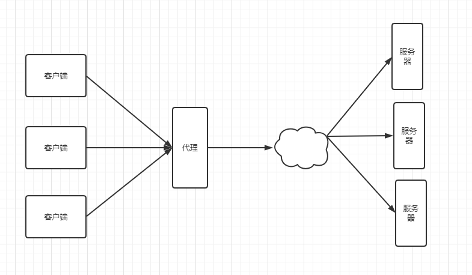
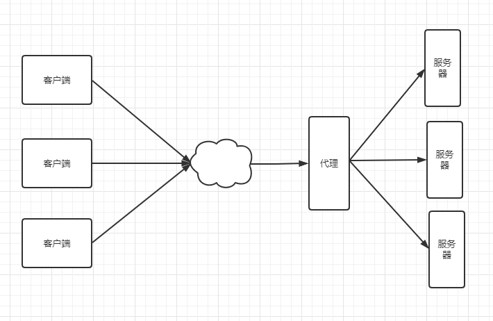
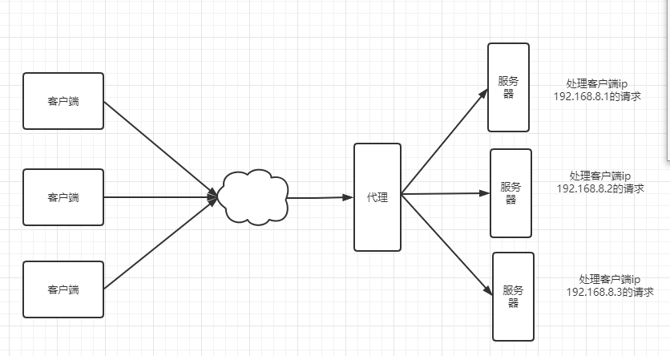
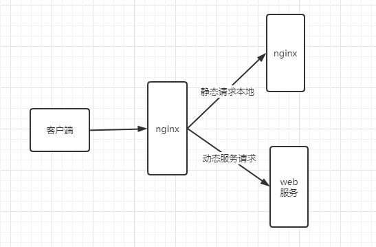
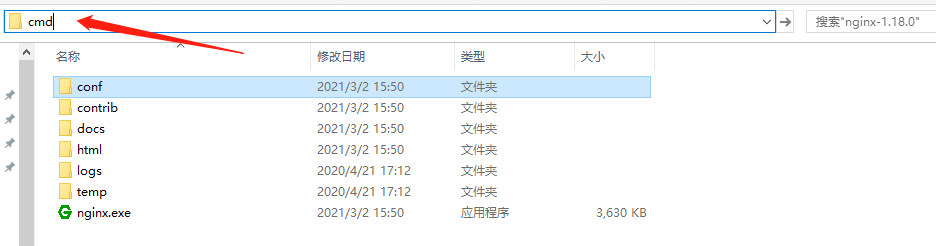
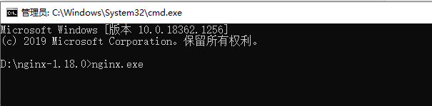
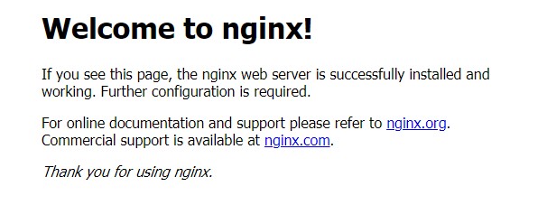
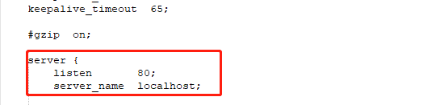

# 什么是Nginx

Nginx（engine x）是一个高性能的HTTP和反向代理web服务器，同时也提供了IMAP/POP3/SMTP服务。Nginx是有伊戈尔.塞索耶夫为俄罗斯访问量第二的Rambler.ru站点开发的，第一个公开版本0.1.0发布于2004年10月4日。2011年6月1日，nginx1.0.4发布。

其特点是占有内存少，并发能力强，事实上nginx的并发能力在同类型的网页服务器中表现较好，中国大陆使用nginx网站用户有：百度、京东、新浪、网易、腾讯、淘宝等。在全球活跃的网站中有12.18%的使用比率，大约为2220万个网站。

Nginx是一个安装非常的简单、配置文件非常简洁（还能够支持perl语法）、Bug非常少的服务。Nginx启动特别容易，并且几乎可以做到7*24不间断运行，即使运行数个月也不需要重新启动。你还能够不间断服务的情况下进行软件版本的升级。

Nginx代码完全用C语言从头写成。官方数据测试表明能够支持高达50000个并发连接数的响应。

# Nginx作用

> Http代理，反向代理：作为web服务器最常用的功能之一，尤其是反向代理

## 正向代理

装在客户端，代理客户端。客户端开启vpn访问国外网，客户端请求香港服务器，香港服务器访问外网



## 反向代理

代理服务器，客户端无感知



## 负载均衡

> Nginx提供的负载均衡策略有2种：内置策略和扩展策略。内置策略为轮询，加权轮询，ip hash。扩展策略，就天马行空，只有你想不到没有他做不到

ip hash对客户端请求的ip进行hash操作，然后根据hash结果将同一个客户端ip的请求分发给同一台服务器进行处理，可以解决session不共享的问题。（存在一个问题：服务器挂了之后数据会全部丢失）



## 动静分离

> 动静分离，在我们的软件开发中，有些请求是需要后台处理的，有些请求是不需要经过后台处理的（如：css、html、jpg、js等等文件），这些不需要经过后台处理的文件称为静态文件。让动态网站里的动态网页根据一定规则把不变的资源和经常变得资源区分开来，动静资源做好了拆分以后，我们就可以根据静态资源的特点将其做缓存操作。提高资源响应的速度。



# Nginx的安装

## windoes下安装

**1.下载nginx**

http://nginx.org/en/download.html下载稳定版本

以nginx/Windows-1.18.0为例，直接下载nginx-1.18.0.zip

下载后解压，解压后如下：


查看conf下的nginx.conf（重要部分）

```shell
server {
        listen       80;			#监听80端口
        server_name  localhost;
```

**2.启动nginx**

有很多种方法启动nginx

（1）直接双击nginx.exe，双击后一个黑色的弹窗一闪而过

（2）切换到nginx解压目录下，打开cmd窗口命令，输入命令``nginx.exe``，回车即可





**3.检查nginx是否启动成功**

直接在浏览器地址栏输入网址http://localhost/，出现以下页面说明启动成功



**4.配置文件**

nginx的配置文件是conf目录下的nginx.conf，默认配置的nginx监听的端口为80，如果80端口被占用可以修改为未被占用的端口即可。



当我们修改了nginx的配置文件nginx.conf时，不需要关闭nginx后重新启动nginx，只需要执行命令`nginx -s reload`即可让改动生效

```shell
`全局配置`
#user  nobody;

`最大连接数`
events {
    worker_connections  1024;
}


http {
	`http配置`
    include       mime.types;
    default_type  application/octet-stream;

   upstream kuangstudy{
   		#负载均衡配置(服务器资源)
   		server 127.0.0.1:8080 weight=1;
   		server 127.0.0.1:8081 weight=1;
   }

    server {
        listen       80;
        server_name  localhost;
        #代理
        
		location / {
            root   html;
            index  index.html index.htm;
			proxy_pass http://kuangstudy
        }

    server {
        listen       443;
        server_name  localhost;
        #代理
}
```


5.关闭nginx

如果使用cmd命令窗口启动nginx，关闭cmd窗口是不能结束nginx进程的，可使用两种方法关闭nginx

（1）输入nginx命令`nginx -s stop`(快速停止nginx)或`nginx -s quit`(完整有序的停止nginx)

（2）使用taskkill `taskkill /f /t /im nginx.exe`

```shell
1.taskkill 是用来终止进程的
2./f是强制终止
3./t终止指定的进程和任何由此启动的子进程
4./im是指定的进程名称
```

## Linux下安装nginx

```shell
#先查看机器上是否安装nginx，不显示目录则代表没有安装
whereis nginx
```

**1.安装gcc**

安装nginx需要先将官网下载的源码进行编译，编译依赖gcc环境，如果没有gcc环境，则需要安装：

```shell
yum install gcc-c++
```

**2.PCRE pcre-devel 安装**

PCRE是一个Perl库，包括perl兼容的正则表达式库。nginx的http模块使用pcre来解析正则表达式，所以需要在linux上安装pcre库，pcre-devel是使用pcre开发的一个二次开发库。nginx也需要此库。命令：

```shell
yum install -y pcre pcre-devel
```

**3.zlib安装**

zlib库提供了很多种压缩和解压缩的方式，nginx使用zlib对http包的内容进行gzip，所以需要在Centos上安装zlib库。

```shell
yum install -y zlib zlib-devel
```

**4.OpenSSL安装**

OpenSSL是一个强大的安全套接字层密码库，囊括主要的密码算法、常用的密钥和证书封装管理功能及SSL协议，并提供丰富的应用程序供测试或其他目的使用。nginx不仅支持http协议，还支持https（即在ssl协议上传输http），所以需要在Centos安装OpenSSL库

```shell
yum install -y openssl openssl-devel
```

**5.下载安装包**

手动下载tar.gz安装包，地址：http://nginx.org/en/download.html

**6.上传至linux服务器，解压安装包**

```shell
tar zxf nginx-1.18.0.tar.gz
```

**7.编译**

```shell
cd nginx-1.18.0
./configure   #配置
make
make install
```

**8.查看nginx是否安装成功**

```shell
whereis nginx
nginx: /usr/local/nginx   #nginx所在的位置
进入/usr/local/nginx目录
#启动
cd /usr/local/nginx/sbin
./nginx
```

**9.检查nginx是否启动成功**

在浏览器访问服务器的地址，如：192.168.0.1:80


# nginx常用命令

```shell
cd /usr/local/nginx/sbin
./nginx 启动
./nginx -s stop 停止
./nginx -s quit 安全退出
./nginx -s reload 重新加载配置文件
./nginx -t 检查配置文件是否语法错误
ps aux | grep nginx 查看nginx进程
```

注意：如果连接不上，检查安全组是否开放端口，或者服务器防火墙是否开放端口

相关命令：

```shell
#开启
service firewalld start
#重启
service firewalld restart
#关闭
service firewalld stop 
#查看防火墙规则
firewall-cmd --list-all
#查询端口是否开放
firewalld-cmd --query-port=8080/tcp
#开放端口
firewalld-cmd --permanent --add-port=80/tcp
#移除端口
firewall-cmd --permanent --remove-port=8080/tcp
#重启防火墙（修改配置后要重启防火墙）
firewall-cmd --reload
#参数解释
firewakk-cmd:是linux提供的操作firewall的一个工具
--permanent:表示设置为持久
--add-port:表示添加的端口
```

# 演示

```shell
upstream lb{
	server 127.0.0.1:8080 weight=1;
	server 127.0.0.1:8081 weight=1;
}
server{
	listen 80;
	server_name localhost;
}
location /{
	proxy_pass http://lb;   #这里的lb要与upstream一致
}
```

